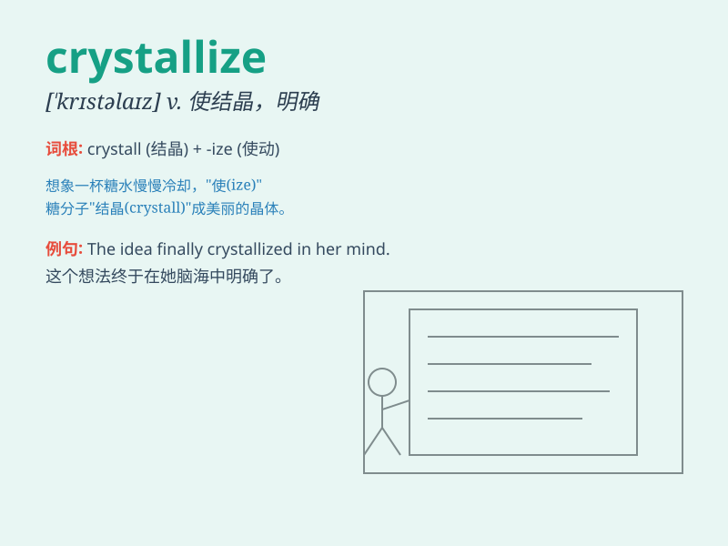

## crystallize

**英音:** _[ˈkrɪstəlaɪz]_ **美音:** _[ˈkrɪstəlaɪz]_

**译义:** *v.明确*

### 短语

+ **crystallize into:** _结晶成；形成_

+ **crystallize out:** _结晶析出_

+ **crystallize one\'s thoughts:** _使想法明确_

+ **crystallize the opinion:** _使意见明确_

+ **crystallize a plan:** _使计划具体化_

### 例句

#### 例句1

> **The idea gradually crystallized in her mind.**

**中文翻译:** 这个想法逐渐在她的脑海中成形。

**单词释义:** （使）变得明确，变得清晰

#### 例句2

> **The salt crystallized as the water evaporated.**

**中文翻译:** 当水蒸发时盐结晶。

**单词释义:** 结晶

#### 例句3

> **His thoughts crystallized into a definite plan.**

**中文翻译:** 他的想法具体化为一个明确的计划。

**单词释义:** 使具体化，使成形

### 背诵小故事

> Once upon a time, a scientist was doing an experiment. He heated a
liquid and waited. Suddenly, the substance began to crystallize, forming
beautiful and clear crystals. This was the moment of crystallize.

**从前，一位科学家在做实验。他加热一种液体并等待。突然，这种物质开始结晶，形成了美丽且清晰的晶体。这就是结晶（crystallize）的时刻。**

### 图义

