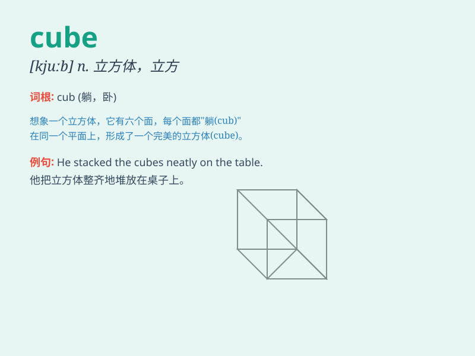

## cube

**英音:** _[kjuːb]_ **美音:** _[kjʊb]_

**译义:** *n.立方体,立方*

### 短语

+ **ice cube:** _冰块_

+ **cube root:** _立方根_

+ **sugar cube:** _方糖_

+ **rubik\'s cube:** _魔方_

+ **magic cube:** _魔术方块_

### 例句

#### 例句1

> **The cube of 3 is 27.**

**中文翻译:** 3 的立方是 27。

**单词释义:** 立方

#### 例句2

> **She cut the cake into small cubes.**

**中文翻译:** 她把蛋糕切成了小方块。

**单词释义:** 方块

#### 例句3

> **This ice cube is very cold.**

**中文翻译:** 这块冰块非常冷。

**单词释义:** 冰块

### 背诵小故事

> Imagine a magical world where a cube-shaped treasure chest holds the
key to great wealth. The cube is perfectly symmetrical, with six equal
square sides. It\'s so shiny and mysterious, making everyone eager to
open it.

**想象一个神奇的世界，有一个立方体形状的宝箱，它藏着巨大财富的钥匙。这个立方体完美对称，有六个相等的正方形面。它如此闪亮和神秘，让每个人都渴望打开它。**

### 图义

