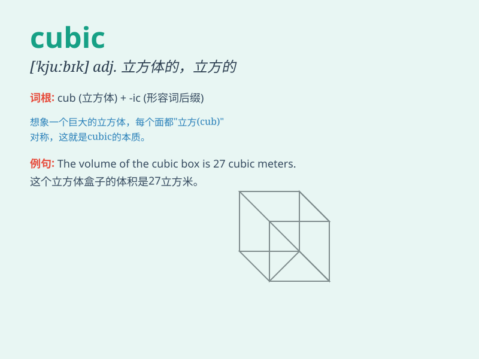

## cubic

**英音:** _[\'kjuːbɪk]_ **美音:** _[\'kjubɪk]_

**译义:** *adj.立方体的,立方的*

### 短语

+ **cubic equation:** _三次方程_

+ **cubic crystal:** _立方晶体_

+ **cubic foot:** _立方英尺_

+ **cubic meter:** _立方米_

+ **cubic polynomial:** _三次多项式_

### 例句

#### 例句1

> **The volume of this cube is cubic meters.**

**中文翻译:** 这个立方体的体积是立方米。

**单词释义:** 立方的

#### 例句2

> **The equation involves a cubic function.**

**中文翻译:** 这个方程涉及一个三次函数。

**单词释义:** 三次的

#### 例句3

> **The cubic shape of the box makes it stackable.**

**中文翻译:** 这个盒子的立方体形状使它可以堆叠。

**单词释义:** 立方体的

### 背诵小故事

> Imagine a magical cube that can change its size. This cube is special
because it represents the idea of \'cubic\'. Every side is measured and
calculated in a cubic way. So, when you see \'cubic\', think of this
magical changing cube!

**想象一个神奇的立方体，它可以改变大小。这个立方体很特别，因为它代表了"立方的"这个概念。它的每条边都是以立方的方式测量和计算的。所以，当你看到"cubic"时，就想想这个神奇的会变化的立方体！**

### 图义

