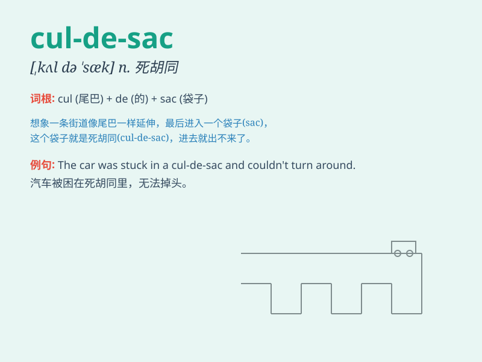

## cul-de-sac

**英音:** _[ˌkʌl də ˈsæk]_ **美音:** _[ˌkʊl də ˈsæk]_

**译义:** *n.死胡同；绝境；尽头*

### 短语

+ **dead-end cul-de-sac:** _死胡同的死巷_

+ **quiet cul-de-sac:** _安静的死巷_

+ **residential cul-de-sac:** _住宅区的死巷_

+ **narrow cul-de-sac:** _狭窄的死巷_

+ **leafy cul-de-sac:** _绿树成荫的死巷_

### 例句

#### 例句1

> **The house is located at the end of a cul-de-sac, providing a
quiet and secluded living environment.**

**中文翻译:**
这座房子位于一条死胡同的尽头，提供了一个安静和隐蔽的居住环境。

**单词释义:** 死胡同

#### 例句2

> **We got lost in the cul-de-sac and had to ask for directions.**

**中文翻译:** 我们在死胡同里迷路了，不得不问路。

**单词释义:** 死胡同

#### 例句3

> **The cul-de-sac was filled with children playing happily.**

**中文翻译:** 死胡同里满是开心玩耍的孩子们。

**单词释义:** 死胡同

### 背诵小故事

> One day, Tom got lost in a strange place. He found himself in a
cul-de-sac. It was a dead-end street with no way out. Poor Tom had to
turn back.

**一天，汤姆在一个陌生的地方迷路了。他发现自己身处一条死胡同。这是一条没有出路的尽头街道。可怜的汤姆不得不原路返回。**

### 图义

