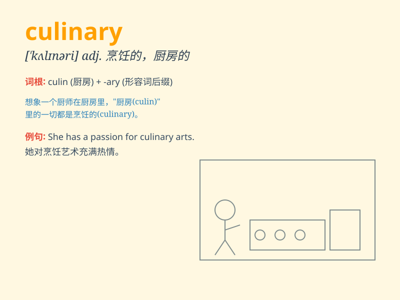

## culinary

**英音:** _[\'kʌlɪn(ə)rɪ]_ **美音:** _[\'kʌlɪnɛri]_

**译义:** *adj.厨房的,烹调用的,厨房用的*

### 短语

+ **culinary art:** _烹饪艺术_

+ **culinary skills:** _烹饪技能_

+ **culinary delights:** _美食佳肴_

+ **culinary adventure:** _烹饪冒险_

+ **culinary masterpiece:** _烹饪杰作_

### 例句

#### 例句1

> **The culinary skills of the chef were highly praised.**

**中文翻译:** 这位厨师的烹饪技巧受到了高度赞扬。

**单词释义:** 烹饪的；厨艺的

#### 例句2

> **She is studying culinary arts at the vocational school.**

**中文翻译:** 她正在职业学校学习烹饪艺术。

**单词释义:** 烹饪的；厨艺的

#### 例句3

> **The restaurant offers a wide range of culinary delights.**

**中文翻译:** 这家餐厅提供各种各样的美食。

**单词释义:** 烹饪的；美食的

### 背诵小故事

> Once upon a time, a chef was known for his culinary skills. He could
turn simple ingredients into delicious dishes. His culinary magic made
everyone happy. Remember, \'culinary\' is all about cooking and food
skills.

**从前，有一位厨师以其烹饪技能而闻名。他能将简单的食材变成美味的菜肴。他的烹饪魔法让每个人都很开心。记住，\'culinary\'与烹饪和食物技能有关。**

### 图义

