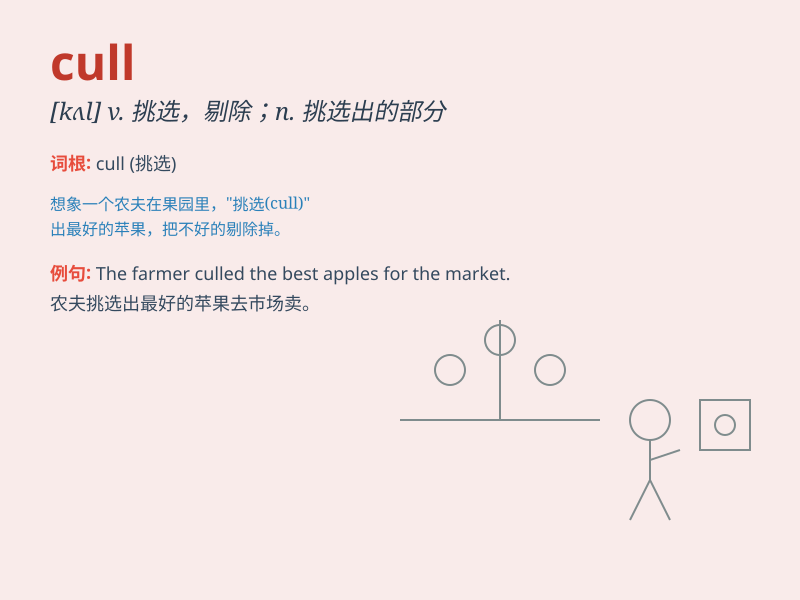

## cull

**英音:** _[kʌl]_ **美音:** _[kʌl]_

**译义:** *v.精选*

### 短语

+ **cull out:** _挑选出；剔除_

+ **cull from:** _从\...\...中挑选；从\...\...中剔除_

+ **cull the herd:** _挑选（或淘汰）畜群_

+ **cull the flock:** _挑选（或淘汰）羊群_

+ **cull the weak:** _淘汰弱者_

### 例句

#### 例句1

> **The farmer decided to cull the weakest sheep from the flock.**

**中文翻译:** 这位农民决定从羊群中剔除最弱的羊。

**单词释义:** 挑选；剔除

#### 例句2

> **The local government is considering a cull of wild deer to
control their population.**

**中文翻译:** 当地政府正在考虑捕杀野生鹿以控制其数量。

**单词释义:** 宰杀；捕杀

#### 例句3

> **We need to cull the unnecessary files to free up some space on
the computer.**

**中文翻译:** 我们需要删除不必要的文件以释放电脑上的一些空间。

**单词释义:** 删除；挑选出来删除

### 背诵小故事

> A farmer was in a big orchard. There were too many apples on the
trees. To get the best ones, he had to cull the bad and small apples.
Finally, he had a basket full of perfect apples.

**一位农民在一个大果园里。树上的苹果太多了。为了得到最好的苹果，他不得不剔除坏的和小的苹果。最后，他有了一篮子完美的苹果。**

### 图义

