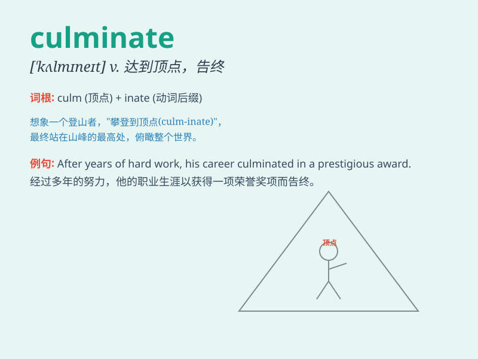

## culminate

**英音:** _[\'kʌlmɪneɪt]_ **美音:** _[\'kʌlmɪnet]_

**译义:** *v.达到顶点*

### 短语

+ **culminate in:** _以......告终；结果成为_

+ **culminate with:** _以......达到高潮_

+ **culminate at:** _在......达到顶点_

+ **culminate from:** _从......发展到顶点_

+ **culminate into:** _最终成为_

### 例句

#### 例句1

> **The project culminated in a successful launch.**

**中文翻译:** 这个项目以成功推出告终。

**单词释义:** 以\...告终；达到\...的顶点

#### 例句2

> **His efforts culminated in a promotion.**

**中文翻译:** 他的努力最终换来了晋升。

**单词释义:** 最终达到（某种结果）

#### 例句3

> **The long journey culminated at the beautiful beach.**

**中文翻译:** 漫长的旅程在美丽的海滩结束。

**单词释义:** 结束；达到终点

### 背诵小故事

> A brave climber struggled up the mountain. After days of effort, he
finally reached the peak. This moment culminated his long and tough
journey. It means reaching the highest or final point.

**一位勇敢的登山者奋力爬山。经过数天的努力，他最终到达了山顶。这一刻成为了他漫长而艰难旅程的顶点。这个单词意思是达到顶点或最终阶段。**

### 图义

