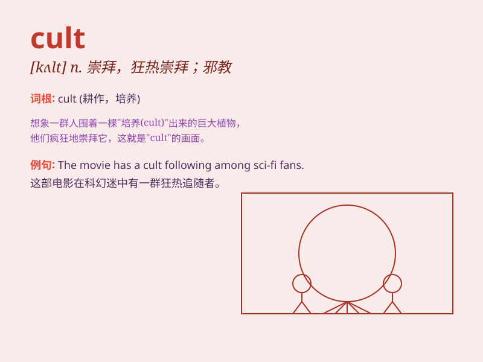

## cult

**英音:** _[kʌlt]_ **美音:** _[kʌlt]_

**译义:** *n.礼拜,祭仪,一群信徒,礼拜式*

### 短语

+ **cult film:** _邪典电影_

+ **cult figure:** _偶像人物；具有号召力的人物_

+ **cult classic:** _邪典经典；小众经典_

+ **cult of personality:** _个人崇拜_

+ **join a cult:** _加入一个邪教_

### 例句

#### 例句1

> **The cult leader brainwashed his followers.**

**中文翻译:** 这个邪教领袖给其追随者洗脑了。

**单词释义:** 邪教

#### 例句2

> **This film has developed a cult following.**

**中文翻译:** 这部电影培养了一批狂热的追随者。

**单词释义:** 狂热的崇拜

#### 例句3

> **The new fashion trend has become a cult among young people.**

**中文翻译:** 新的时尚潮流在年轻人中已蔚然成风。

**单词释义:** 风尚；潮流

### 背诵小故事

> In a small town, there was a strange group. They had unique beliefs
and rituals, which made them stand out. This group was known as a cult.
People were cautious of their odd ways.

**在一个小镇上，有一个奇怪的团体。他们有着独特的信仰和仪式，这使他们与众不同。这个团体被称为邪教。人们对他们奇怪的方式很谨慎。**

### 图义

