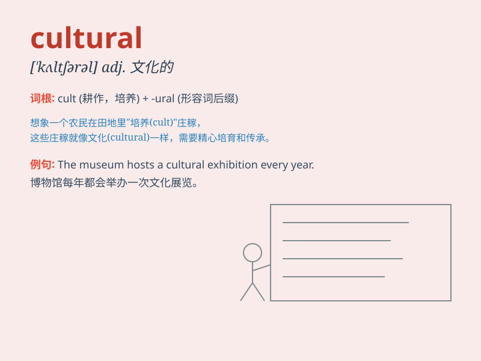

## cultural

**英音:** _[\'kʌltʃ(ə)r(ə)l]_ **美音:** _[\'kʌltʃərəl]_

**译义:** *adj.文化的*

### 短语

+ **cultural background:** _文化背景_

+ **cultural exchange:** _文化交流_

+ **cultural heritage:** _文化遗产_

+ **cultural diversity:** _文化多样性_

+ **cultural values:** _文化价值观_

### 例句

#### 例句1

> **The cultural differences between the two countries are
significant.**

**中文翻译:** 这两个国家之间的文化差异很显著。

**单词释义:** 文化的

#### 例句2

> **She is very interested in cultural activities such as art
exhibitions and music festivals.**

**中文翻译:** 她对艺术展览和音乐节等文化活动非常感兴趣。

**单词释义:** 文化的

#### 例句3

> **The city has a rich cultural heritage.**

**中文翻译:** 这座城市拥有丰富的文化遗产。

**单词释义:** 文化的

### 背诵小故事

> A group of friends went on a trip to different countries. They saw
many cultural shows, like traditional dances and music. They learned
that \'cultural\' means related to the customs and art of a particular
group or society.

**一群朋友去不同的国家旅行。他们看了很多文化表演，比如传统舞蹈和音乐。他们了解到'cultural'这个词意味着与特定群体或社会的习俗和艺术有关。**

### 图义

