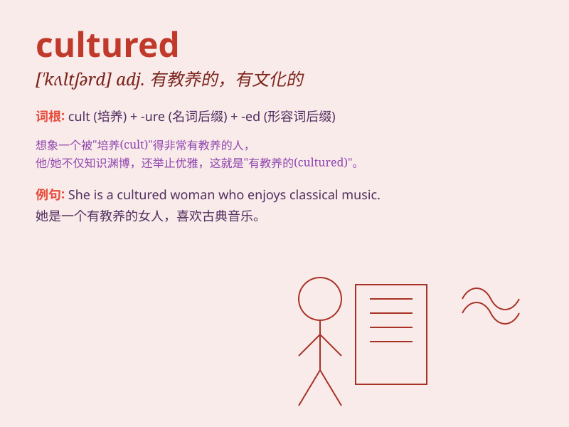

## cultured

**英音:** _[\'kʌltʃəd]_ **美音:** _[\'kʌltʃɚd]_

**译义:** *adj.有教养的,讲究的,有修养的*

### 短语

+ **cultured pearl:** _养殖珍珠_

+ **cultured person:** _有教养的人_

+ **cultured bacteria:** _培养的细菌_

+ **cultured dairy products:** _发酵乳制品_

+ **highly cultured:** _高度有教养的；文化修养高的_

### 例句

#### 例句1

> **She is a very cultured woman, with a love for art and
literature.**

**中文翻译:** 她是一个非常有教养的女人，热爱艺术和文学。

**单词释义:** 有教养的

#### 例句2

> **The city has a cultured atmosphere, with many museums and
theaters.**

**中文翻译:** 这座城市有一种有文化氛围，有许多博物馆和剧院。

**单词释义:** 有文化的

#### 例句3

> **His speech was refined and cultured, impressing everyone in the
audience.**

**中文翻译:**
他的演讲优雅且有教养，给观众中的每个人都留下了深刻的印象。

**单词释义:** 有修养的

### 背诵小故事

> Once upon a time, there was a man who traveled to many countries. He
learned different cultures, became very knowledgeable and refined. We
can say he was cultured. He could talk politely and behave gracefully
everywhere.

**从前，有一个人游历了许多国家。他学习了不同的文化，变得非常博学和有修养。我们可以说他是有教养的。他在任何地方都能礼貌地交谈，举止优雅。**

### 图义

