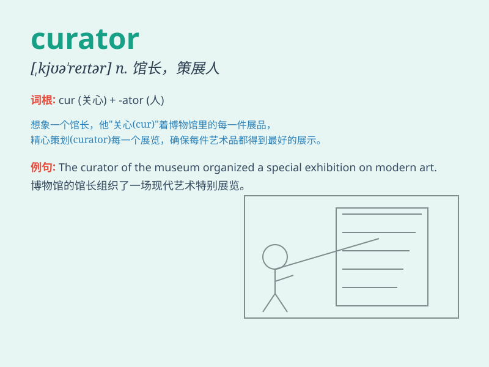

## curator

**英音:** _[kjʊ(ə)\'reɪtə]_ **美音:** _[kjʊ\'retɚ]_

**译义:** *n.馆长,监护人*

### 短语

+ **museum curator:** _博物馆馆长_

+ **art curator:** _艺术策展人_

+ **curator of exhibitions:** _展览策展人_

+ **chief curator:** _首席策展人_

+ **curator of collections:** _藏品管理员_

### 例句

#### 例句1

> **The curator of the art museum curated a remarkable
exhibition.**

**中文翻译:** 艺术博物馆的馆长策划了一场非凡的展览。

**单词释义:** 馆长

#### 例句2

> **The curator is responsible for the preservation of historical
artifacts.**

**中文翻译:** 这位管理员负责历史文物的保存。

**单词释义:** 管理员

#### 例句3

> **The zoo curator ensures the well-being of the animals.**

**中文翻译:** 动物园的负责人确保动物们的健康。

**单词释义:** 负责人

### 背诵小故事

> A curator is like a guardian of a treasure chest. Imagine a room full
of precious artworks. The curator is the one who takes care of them,
decides which to show, and makes sure they are safe. Just like that, a
curator looks after and manages valuable things.

**一位馆长就像是一个宝箱的守护者。想象一个满是珍贵艺术品的房间。馆长是照顾它们、决定展示哪些以及确保它们安全的人。就像这样，馆长照看和管理有价值的东西。**

### 图义

