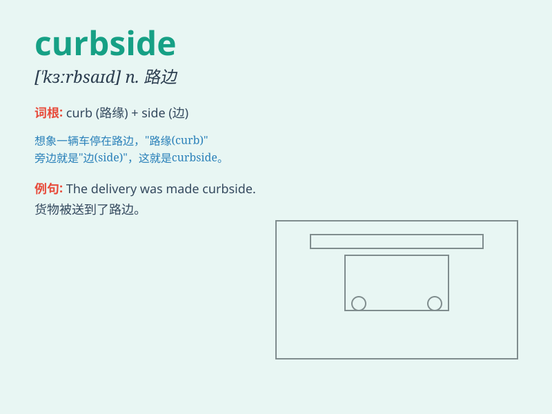

## curbside

**英音:** _[\'kɜːbsaɪd]_ **美音:** _[\'kɝbsaɪd]_

**译义:** *n.靠近路缘的人行道部分,路边*

### 短语

+ **curbside pickup:** _路边提货；路边取货_

+ **curbside appeal:** _路边吸引力；临街外观吸引力_

+ **curbside service:** _路边服务_

+ **curbside consultation:** _路边咨询_

+ **curbside garbage:** _路边垃圾_

### 例句

#### 例句1

> **I waited for you at the curbside.**

**中文翻译:** 我在路边等你。

**单词释义:** 路边

#### 例句2

> **The car was parked at the curbside.**

**中文翻译:** 汽车停在路边。

**单词释义:** 路边

#### 例句3

> **He threw the garbage into the bin at the curbside.**

**中文翻译:** 他把垃圾扔进了路边的垃圾桶。

**单词释义:** 路边

### 背诵小故事

> One day, I was walking along the street and saw a lost puppy sitting
by the curbside. It looked so helpless. I decided to help it find its
owner. The curbside became a memorable place for me that day.

**有一天，我沿着街道走，看到一只迷路的小狗坐在路边。它看起来很无助。我决定帮它找到主人。那天路边对我来说成了一个难忘的地方。**

### 图义

