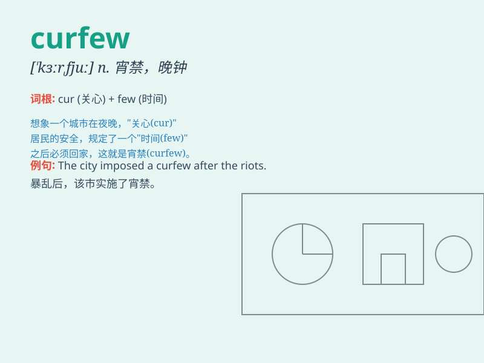

## curfew

**英音:** _[\'kɜːfjuː]_ **美音:** _[\'kɝfju]_

**译义:**
*n.(中世纪规定人们熄灯安睡的)晚钟声,打晚钟时刻,宵禁令(时间)*

### 短语

+ **impose a curfew:** _实施宵禁_

+ **lift the curfew:** _解除宵禁_

+ **violate the curfew:** _违反宵禁_

+ **enforce the curfew:** _执行宵禁_

+ **be under curfew:** _处于宵禁状态_

### 例句

#### 例句1

> **The city has imposed a curfew to maintain public safety.**

**中文翻译:** 该市实施宵禁以维护公共安全。

**单词释义:** 宵禁

#### 例句2

> **You must be home before the curfew or you\'ll be in trouble.**

**中文翻译:** 你必须在宵禁之前回家，否则你就会有麻烦了。

**单词释义:** 宵禁

#### 例句3

> **The curfew was lifted after the situation improved.**

**中文翻译:** 情况好转后，宵禁被解除。

**单词释义:** 宵禁

### 背诵小故事

> In a small town, there was a curfew every night. One naughty kid
always tried to break it. But the strict police caught him every time.
Remember, curfew means a time limit after which people must stay at
home.

**在一个小镇上，每晚都有宵禁。一个顽皮的孩子总是试图打破它。但严格的警察每次都抓住他。记住，curfew
意思是在某个时间之后人们必须待在家里的限制。**

### 图义

