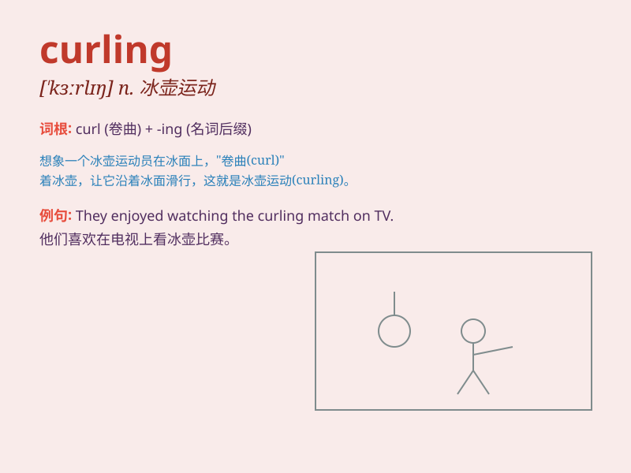

## curling

**英音:** _[\'kɜːlɪŋ]_ **美音:** _[\'kɝlɪŋ]_

**译义:** *n.苏格兰的冰上掷石游戏,头发的卷曲,卷缩*

### 短语

+ **curling stone:** _冰壶石_

+ **curling iron:** _卷发棒_

+ **curling rink:** _冰壶场_

+ **curling championship:** _冰壶锦标赛_

+ **curling brush:** _卷发刷_

### 例句

#### 例句1

> **I enjoy watching curling matches on TV.**

**中文翻译:** 我喜欢在电视上观看冰壶比赛。

**单词释义:** 冰壶（运动）

#### 例句2

> **The curling stone moved smoothly across the ice.**

**中文翻译:** 冰壶石在冰面上平稳地移动。

**单词释义:** 冰壶石

#### 例句3

> **She has been practicing curling for years.**

**中文翻译:** 她多年来一直练习冰壶。

**单词释义:** 冰壶（运动）

### 背诵小故事

> One cold winter day, I went to an ice rink and saw people playing
curling. They were sliding heavy stones on the ice. The stones moved in
a curling path, which was so interesting.

**一个寒冷的冬日，我去了溜冰场，看到人们在玩冰壶。他们在冰面上滑动沉重的石头。石头沿着弯曲的路径移动，非常有趣。**

### 图义

