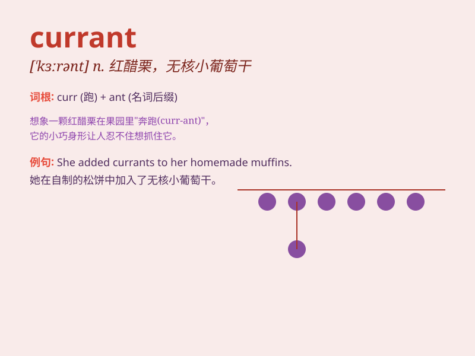

## currant

**英音:** _[\'kʌr(ə)nt]_ **美音:** _[\'kɝənt]_

**译义:** *n.(无核)葡萄干,[植]黑醋栗*

### 短语

+ **black currant:** _黑醋栗_

+ **red currant:** _红醋栗_

+ **currant jelly:** _醋栗果冻_

+ **currant bush:** _醋栗灌木丛_

+ **currant cake:** _醋栗蛋糕_

### 例句

#### 例句1

> **I love the taste of currants in my cake.**

**中文翻译:** 我喜欢我蛋糕里葡萄干的味道。

**单词释义:** 葡萄干

#### 例句2

> **The currant bushes in the garden are bearing fruit.**

**中文翻译:** 花园里的醋栗丛正在结果。

**单词释义:** 醋栗

#### 例句3

> **She added some currants to the pudding for extra flavor.**

**中文翻译:** 她在布丁里加了一些葡萄干以增添风味。

**单词释义:** 葡萄干

### 背诵小故事

> Once upon a time, a little girl was very hungry. She found some
currants in the garden. They were small and sweet. She ate them happily
and felt full. Remember, currants are these sweet little fruits.

**从前，有个小女孩非常饿。她在花园里发现了一些醋栗。它们小小的，甜甜的。她开心地吃了，然后觉得饱了。记住，currant
就是这种小小的甜水果。**

### 图义

