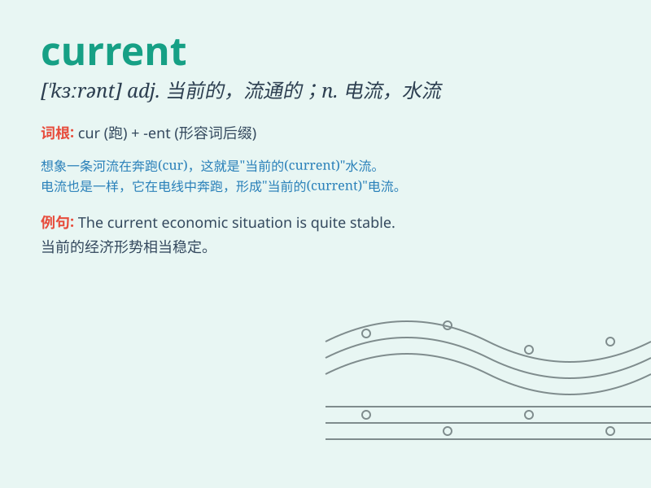

## current

**英音:** _[\'kʌr(ə)nt]_ **美音:** _[\'kɜrənt]_

**译义:**
*adj.当前的,通用的,流通的,现在的,草写的,最近的n.涌流,趋势,电流,水流,气流*

### 短语

+ **current affairs:** _时事_

+ **current situation:** _现状；当前形势_

+ **current account:** _活期存款账户_

+ **current price:** _现行价格；时价_

+ **electric current:** _电流_

### 例句

#### 例句1

> **The current situation is quite challenging.**

**中文翻译:** 当前的形势相当具有挑战性。

**单词释义:** 当前的；现在的

#### 例句2

> **The current flows through the wire.**

**中文翻译:** 电流通过电线。

**单词释义:** 流；流动

#### 例句3

> **She is not up to date with the current fashion trends.**

**中文翻译:** 她跟不上当前的时尚潮流。

**单词释义:** 当前的；现在的

### 背诵小故事

> 想象一条河流，水在不停地流淌。这流动的水就像 current
所代表的'水流、电流、趋势'。比如现在流行的时尚趋势，就像这不停变化的水流一样，这就是
current 的含义。

**想象一条河，其中流动的水代表\'current\'的'水流、电流、趋势'等含义，比如流行的时尚趋势就像不停变化的水流。**

### 图义

