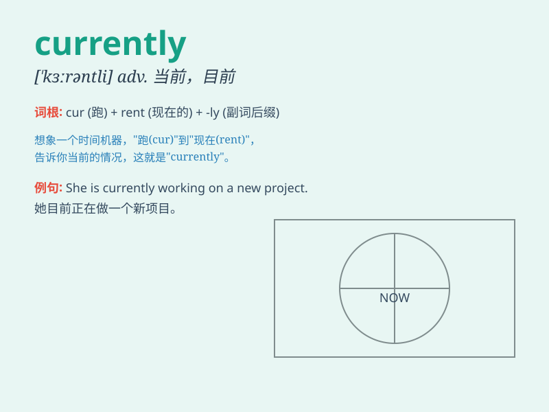

## currently

**英音:** _[\'kʌrəntlɪ]_ **美音:** _[\'kɝrəntlɪ]_

**译义:** *adv.普遍地,通常地,现在,当前*

### 短语

+ **currently available:** _目前可用的_

+ **currently in use:** _当前正在使用_

+ **currently employed:** _目前受雇_

+ **currently studying:** _目前正在学习_

+ **currently living:** _目前居住_

### 例句

#### 例句1

> **I\'m currently reading a fascinating book.**

**中文翻译:** 我目前正在读一本引人入胜的书。

**单词释义:** 当前；目前

#### 例句2

> **The company is currently facing some financial difficulties.**

**中文翻译:** 这家公司目前正面临一些财务困难。

**单词释义:** 当下；此刻

#### 例句3

> **She is currently working on a new project.**

**中文翻译:** 她目前正在做一个新项目。

**单词释义:** 现在；现今

### 背诵小故事

> Imagine you are in a time machine. Right now, as you are traveling,
you are experiencing the \'currently\' moment. It\'s like being in the
present, exactly at this point in time. So, \'currently\' means at the
present time.

**想象你在一台时光机里。此刻，当你在旅行时，你正处于'currently'的时刻。这就像是处于当下，确切地就在这个时间点。所以，'currently'意思是当前，现在。**

### 图义

