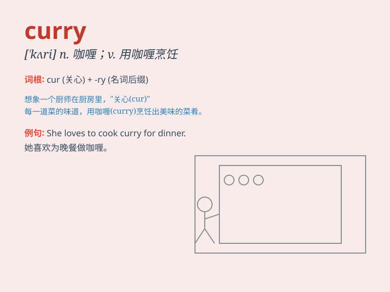

## curry

**英音:** _[\'kʌrɪ]_ **美音:** _[\'kɝi]_

**译义:** *n.咖哩粉,咖哩饭菜vt.用咖哩粉调味,用马梳梳,制革*

### 短语

+ **curry favor:** _讨好；奉承；拍马屁_

+ **curry powder:** _咖喱粉_

+ **curry comb:** _马梳； curry 梳_

+ **curry sauce:** _咖喱酱_

+ **curry and rice:** _咖喱饭_

### 例句

#### 例句1

> **I love the curry chicken dish at that restaurant.**

**中文翻译:** 我喜欢那家餐厅的咖喱鸡这道菜。

**单词释义:** 咖喱

#### 例句2

> **She is learning how to curry favor with her boss.**

**中文翻译:** 她正在学习如何讨好她的老板。

**单词释义:** 讨好；奉承

#### 例句3

> **The chef is expert at currying vegetables.**

**中文翻译:** 这位厨师擅长用咖喱烹制蔬菜。

**单词释义:** 用咖喱烧

### 背诵小故事

> One day, Tom was very hungry. He went to a restaurant and ordered
curry. The chef cooked the curry carefully with many spices. Tom loved
the delicious curry and ate a lot.

**有一天，汤姆非常饿。他去了一家餐馆并点了咖喱。厨师用许多香料精心烹制了咖喱。汤姆喜欢这美味的咖喱并吃了很多。**

### 图义

