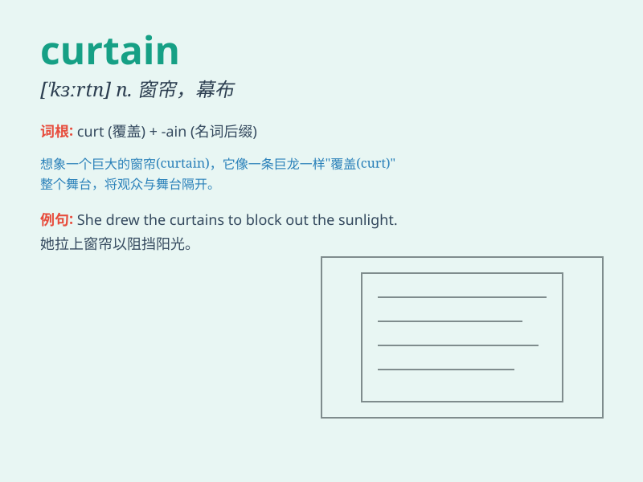

## curtain

**英音:** _[\'kɜːt(ə)n]_ **美音:** _[ˈkɜrtən]_

**译义:** *n.窗帘,门帘v.装上门帘*

### 短语

+ **behind the curtain:** _在幕后_

+ **draw the curtain:** _拉上窗帘_

+ **curtain call:** _谢幕_

+ **lift the curtain:** _揭开帷幕_

+ **ring down the curtain:** _落幕；结束_

### 例句

#### 例句1

> **The curtain was drawn to block out the sunlight.**

**中文翻译:** 窗帘被拉上以阻挡阳光。

**单词释义:** 窗帘

#### 例句2

> **He peeked behind the curtain to see what was going on.**

**中文翻译:** 他从窗帘后面偷看，想看看发生了什么。

**单词释义:** 窗帘

#### 例句3

> **The stage curtain rose and the play began.**

**中文翻译:** 舞台幕布升起，戏剧开始了。

**单词释义:** 幕布

### 背诵小故事

> A thief wanted to steal jewels from a rich man\'s room. But when he
entered, he accidentally knocked over a vase and the noise woke the
owner. The thief quickly hid behind the curtain. The curtain saved him
from being caught for the moment.

**一个小偷想从一个富人的房间偷珠宝。但当他进入时，不小心打翻了一个花瓶，声音吵醒了主人。小偷迅速躲在窗帘后面。窗帘暂时让他没被抓住。**

### 图义

