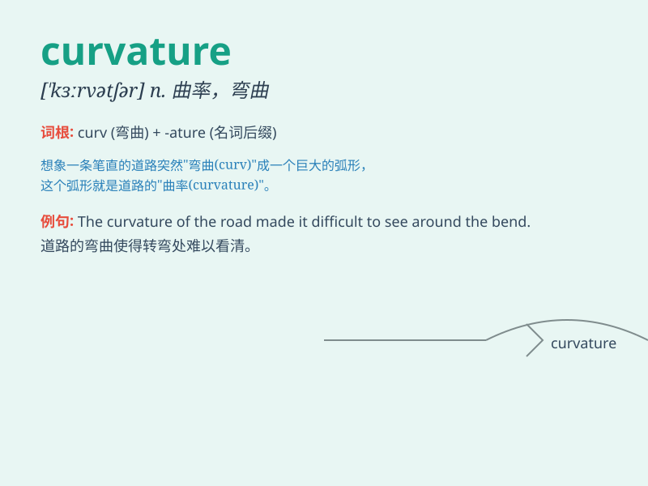

## curvature

**英音:** _[\'kɜːvətʃə]_ **美音:** _[\'kɝvətʃɚ]_

**译义:** *n.弯曲,曲率*

### 短语

+ **curvature of a curve:** _曲线的曲率_

+ **radius of curvature:** _曲率半径_

+ **mean curvature:** _平均曲率_

+ **Gaussian curvature:** _高斯曲率_

+ **curvature tensor:** _曲率张量_

### 例句

#### 例句1

> **The curvature of the road made driving difficult.**

**中文翻译:** 道路的弯曲度使驾驶变得困难。

**单词释义:** 弯曲；曲率

#### 例句2

> **The engineer calculated the curvature of the bridge to ensure its
stability.**

**中文翻译:** 工程师计算了桥梁的曲率以确保其稳定性。

**单词释义:** 曲率

#### 例句3

> **The curvature of the spine can cause serious health problems.**

**中文翻译:** 脊柱的弯曲可能会导致严重的健康问题。

**单词释义:** 弯曲

### 背诵小故事

> One day, while walking in the park, I saw a beautiful bridge. Its
shape had a special charm, and I learned that this feature was called
\'curvature\'. The gentle curves made the bridge both elegant and
stable.

**有一天，在公园散步时，我看到一座漂亮的桥。它的形状有一种特殊的魅力，我了解到这个特征被称为"曲率"。柔和的曲线使这座桥既优雅又稳固。**

### 图义

