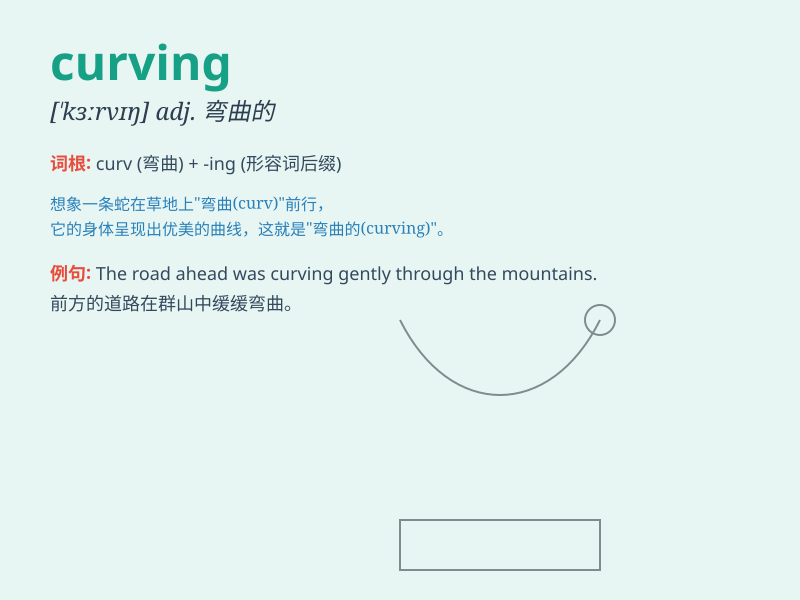

## curving

**英音:** _[ˈkɜːvɪŋ]_ **美音:** _[ˈkɜːrvɪŋ]_

**译义:** *adj.弯曲的*

### 短语

+ **curving path:** _弯曲的路径_

+ **curving road:** _弯曲的道路_

+ **curving line:** _曲线_

+ **curving coastline:** _弯曲的海岸线_

+ **curving staircase:** _弯曲的楼梯_

### 例句

#### 例句1

> **The road is curving sharply to the left.**

**中文翻译:** 这条路向左急转弯。

**单词释义:** 弯曲；呈曲线

#### 例句2

> **She drew a curving line on the paper.**

**中文翻译:** 她在纸上画了一条曲线。

**单词释义:** 使弯曲；绘制曲线

#### 例句3

> **The curving branches of the old tree formed a beautiful
shape.**

**中文翻译:** 那棵老树弯曲的树枝形成了一个美丽的形状。

**单词释义:** 弯曲的

### 背诵小故事

> One day, I was walking in a park and saw a beautiful curving path. It
was like a snake, smoothly bending and leading to a hidden garden. The
curving shape made the path very charming.

**有一天，我在公园散步，看到一条美丽的弯曲小路。它就像一条蛇，平滑地弯曲着，通向一个隐藏的花园。弯曲的形状让这条小路非常迷人。**

### 图义

