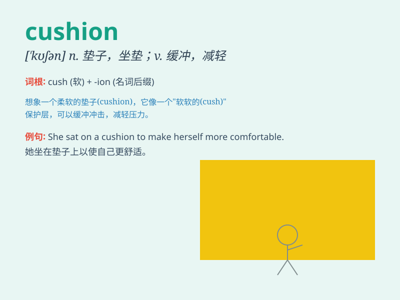

## cushion

**英音:** _[\'kʊʃ(ə)n]_ **美音:** _[\'kʊʃən]_

**译义:** *n.垫子,软垫,衬垫v.加衬垫*

### 短语

+ **cushion the blow:** _减轻打击；缓和不利影响_

+ **sofa cushion:** _沙发垫_

+ **seat cushion:** _座垫_

+ **cushion effect:** _缓冲作用；减震效果_

+ **cushion cover:** _靠垫套；坐垫套_

### 例句

#### 例句1

> **She sank into the soft cushion of the sofa.**

**中文翻译:** 她陷进了沙发柔软的靠垫里。

**单词释义:** 靠垫；坐垫

#### 例句2

> **The air cushion helped him land safely.**

**中文翻译:** 气垫帮助他安全着陆。

**单词释义:** 气垫

#### 例句3

> **His savings served as a cushion against financial
difficulties.**

**中文翻译:** 他的积蓄充当了应对财务困难的缓冲。

**单词释义:** 起缓冲作用的事物；缓冲垫

### 背诵小故事

> One day, I was very tired and sat on a soft cushion. It was like a
cloud, making me feel extremely comfortable. The cushion absorbed all my
fatigue. Now, whenever I see \'cushion\', I remember that relaxing
moment.

**有一天，我非常累，坐在了一个柔软的垫子上。它就像一朵云，让我感到极其舒适。这个垫子吸收了我所有的疲惫。现在，每当我看到\'cushion\'这个单词，我就会想起那个放松的时刻。**

### 图义

