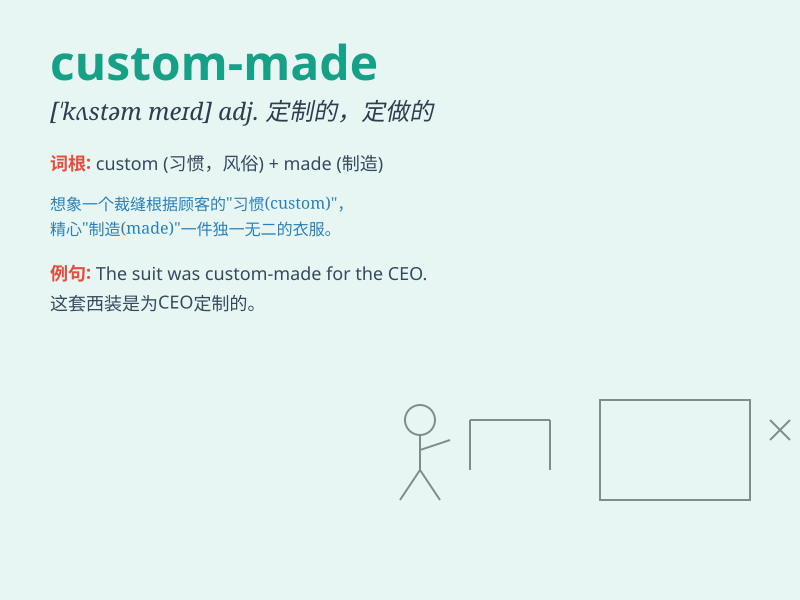

## custom-made

**英音:** _[ˈkʌstəm meɪd]_ **美音:** _[ˈkʌstəm meɪd]_

**译义:** *adj. 定制的；定做的*

### 短语

+ **custom-made suit:** _定制西装_

+ **custom-made furniture:** _定制家具_

+ **custom-made dress:** _定制连衣裙_

+ **custom-made shoes:** _定制鞋子_

+ **custom-made jewelry:** _定制珠宝_

### 例句

#### 例句1

> **I ordered a custom-made dress for the wedding.**

**中文翻译:** 我为婚礼订购了一件定制的连衣裙。

**单词释义:** 定制的

#### 例句2

> **The furniture in his office is all custom-made.**

**中文翻译:** 他办公室的家具都是定制的。

**单词释义:** 定制的

#### 例句3

> **She has a pair of custom-made shoes that fit her perfectly.**

**中文翻译:** 她有一双非常合脚的定制鞋子。

**单词释义:** 定制的

### 背诵小故事

> A princess needed a special dress for the ball. So, she ordered a
custom-made one. The tailor worked hard, making it exactly as she
wanted. It was unique and fit her perfectly. Custom-made means made
specially to someone\'s particular needs.

**一位公主需要一件参加舞会的特别礼服。于是，她订购了一件定制的。裁缝努力工作，完全按照她的要求制作。它独一无二，非常合身。custom-made
意思是专门根据某人的特定需求制作的。**

### 图义

