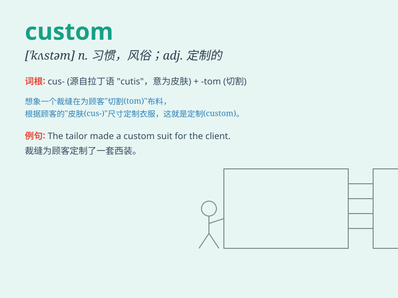

## custom

**英音:** _[\'kʌstəm]_ **美音:** _[\'kʌstəm]_

**译义:**
*n.习惯,风俗,\<动词单用>海关,(封建制度下)定期服劳役,缴纳租税,自定义,\<偶用作>关税v.定制,承接定做活的*

### 短语

+ **custom duty:** _关税_

+ **custom house:** _海关_

+ **custom made:** _定制的；定做的_

+ **custom officer:** _海关官员_

+ **local custom:** _当地风俗_

### 例句

#### 例句1

> **It is the custom in that country for women to marry young.**

**中文翻译:** 在那个国家，女子早婚是一种习俗。

**单词释义:** 习俗

#### 例句2

> **The custom of lighting the Olympic flame goes back centuries.**

**中文翻译:** 点燃奥林匹克圣火的习俗可以追溯到几个世纪以前。

**单词释义:** 习俗

#### 例句3

> **He had the custom-made suit tailored to fit him perfectly.**

**中文翻译:** 他让人定制的那套西装裁剪得非常合身。

**单词释义:** 定制的

### 背诵小故事

> A foreigner came to a small town. He was confused by the local custom
of giving gifts to strangers. But when he received a warm gift, he
understood that it was a sign of friendship.

**一个外国人来到一个小镇。他对当地给陌生人送礼物的习俗感到困惑。但当他收到一份温暖的礼物时，他明白了这是友谊的象征。**

### 图义

