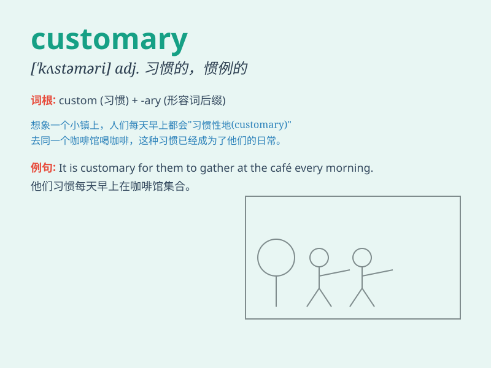

## customary

**英音:** _[\'kʌstəm(ə)rɪ]_ **美音:** _[\'kʌstə\'mɛri]_

**译义:** *adj.习惯的,惯例的*

### 短语

+ **customary law:** _习惯法_

+ **customary practice:** _惯例；习惯做法_

+ **customary rights:** _习惯权利_

+ **customary route:** _惯常路线_

+ **customary price:** _习惯价格_

### 例句

#### 例句1

> **It is customary to tip the waiter in this restaurant.**

**中文翻译:** 在这家餐厅给服务员小费是惯例。

**单词释义:** 惯例的；习惯上的

#### 例句2

> **Wearing black to a funeral is customary in many cultures.**

**中文翻译:** 在许多文化中，葬礼穿黑色是习俗。

**单词释义:** 习惯的；习俗的

#### 例句3

> **It is customary for the bride to wear white on her wedding
day.**

**中文翻译:** 新娘在婚礼当天穿白色是惯例。

**单词释义:** 通常的；惯常的

### 背诵小故事

> A king had a customary way of greeting his subjects every morning. It
was his usual and traditional practice. One day, a new subject was
amazed by this customary ritual. \'Customary\' means according to the
usual and traditional way.

**一位国王每天早上都有向臣民问候的习惯方式。这是他一贯的、传统的做法。有一天，一位新来的臣民对这种习惯性的仪式感到惊讶。\'customary\'意思是依照通常的和传统的方式。**

### 图义

