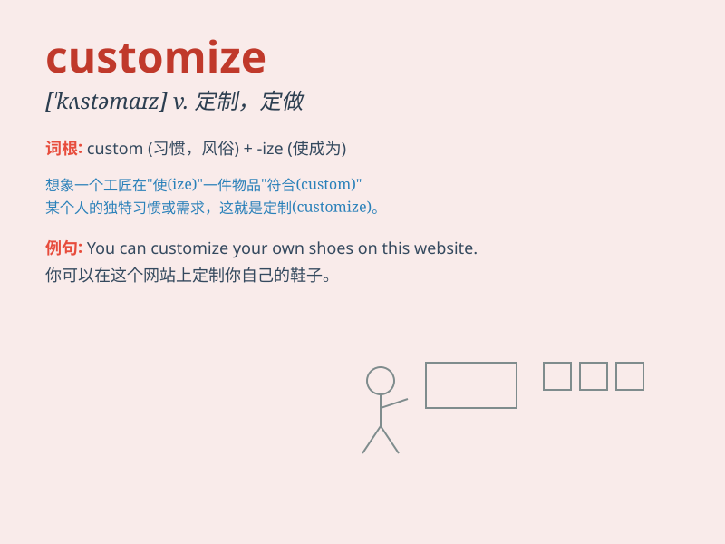

## customize

**英音:** _[\'kʌstəmaɪz]_ **美音:** _[\'kʌstəmaɪz]_

**译义:** *v.[计] 定制,用户化*

### 短语

+ **customize settings:** _自定义设置_

+ **customize products:** _定制产品_

+ **customize interface:** _定制界面_

+ **customize service:** _定制服务_

+ **customize experience:** _定制体验_

### 例句

#### 例句1

> **You can customize your car to your own preferences.**

**中文翻译:** 你可以根据自己的喜好定制你的汽车。

**单词释义:** 定制

#### 例句2

> **The software allows users to customize the interface.**

**中文翻译:** 这款软件允许用户自定义界面。

**单词释义:** 自定义

#### 例句3

> **We can customize the tour package based on your needs.**

**中文翻译:** 我们可以根据您的需求定制旅游套餐。

**单词释义:** 定制

### 背诵小故事

> A designer wanted to create unique clothes. So, he decided to
customize each piece based on customers\' requests. He carefully
selected materials and added special details to make them one-of-a-kind.

**一位设计师想要制作独特的衣服。所以，他决定根据顾客的要求定制每一件。他精心挑选材料并添加特殊细节以使它们独一无二。**

### 图义

