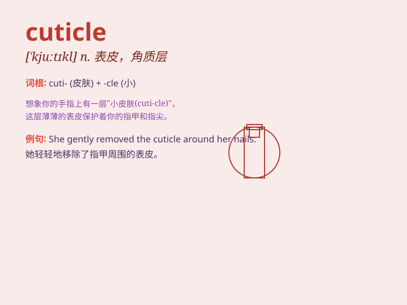

## cuticle

**英音:** _[\'kjuːtɪk(ə)l]_ **美音:** _[\'kjʊtɪkl]_

**译义:** *n.表皮*

### 短语

+ **nail cuticle:** _指甲角质层_

+ **cuticle cream:** _角质层霜_

+ **cuticle remover:** _角质层去除剂_

+ **cuticle scissors:** _角质层剪刀_

+ **cuticle oil:** _角质层油_

### 例句

#### 例句1

> **The cuticle of the plant helps prevent water loss.**

**中文翻译:** 植物的角质层有助于防止水分流失。

**单词释义:** 角质层

#### 例句2

> **She carefully manicured her cuticles.**

**中文翻译:** 她仔细修剪了自己的指甲角质层。

**单词释义:** （指甲根部的）外皮，角质层

#### 例句3

> **The insect\'s cuticle provides protection from the
environment.**

**中文翻译:** 这种昆虫的外皮为其提供了抵御环境的保护。

**单词释义:** （昆虫等的）外皮

### 背诵小故事

> One day, a little bug was very sad because its cuticle was damaged.
But then it found a magic potion that helped restore its shiny and
strong cuticle. Now it could move freely again!

**有一天，一只小虫子非常伤心，因为它的角质层受损了。但随后它找到了一瓶神奇的药水，帮助恢复了它闪亮且坚固的角质层。现在它又能自由活动了！**

### 图义

