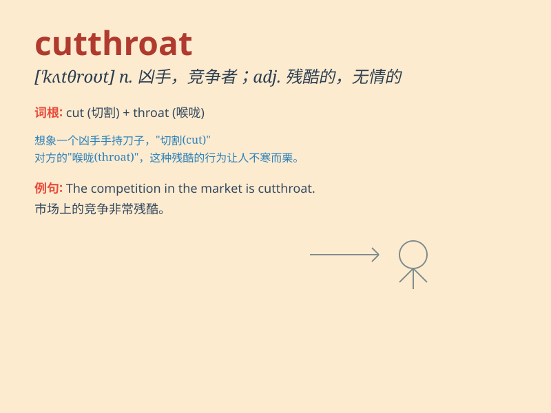

## cutthroat

**英音:** _[ˈkʌtθrəʊt]_ **美音:** _[ˈkʌtˌθroʊt]_

**译义:** *n.凶手,谋杀者adj.残酷的,杀人的*

### 短语

+ **cutthroat competition:** _激烈竞争；残酷竞争_

+ **cutthroat business:** _残酷的商业；竞争激烈的商业_

+ **cutthroat game:** _残酷的游戏；激烈的游戏_

+ **cutthroat world:** _残酷的世界；竞争激烈的世界_

+ **cutthroat market:** _竞争激烈的市场；残酷的市场_

### 例句

#### 例句1

> **The cutthroat competition in the business world is fierce.**

**中文翻译:** 商业世界中的残酷竞争是激烈的。

**单词释义:** 残酷的，激烈的

#### 例句2

> **He was known for his cutthroat tactics in the political
arena.**

**中文翻译:** 他在政治舞台上因其残酷的策略而闻名。

**单词释义:** 残酷无情的

#### 例句3

> **The cutthroat market has forced many small companies out of
business.**

**中文翻译:** 残酷的市场迫使许多小公司倒闭。

**单词释义:** 竞争激烈的

### 背诵小故事

> In a dark forest, a cutthroat bandit lurked. He had a cruel face and
was ready to attack anyone for treasure. One day, he met a brave knight
who defeated him. Remember, \'cutthroat\' means a ruthless and cruel
person.

**在一个黑暗的森林里，有一个凶残的强盗潜伏着。他一脸凶残，随时准备为财宝攻击任何人。有一天，他遇到了一位勇敢的骑士，骑士打败了他。记住，'cutthroat'意思是残忍无情的人。**

### 图义

