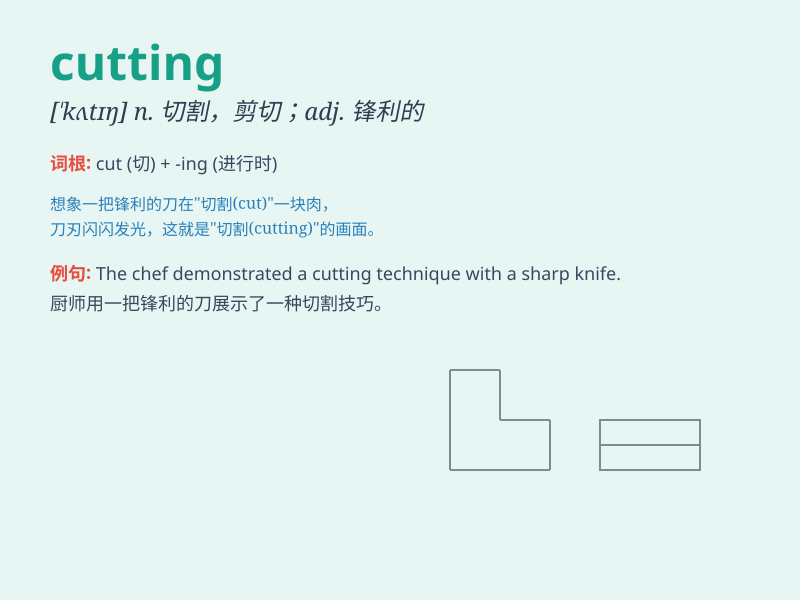

## cutting

**英音:** _[\'kʌtɪŋ]_ **美音:** _[\'kʌtɪŋ]_

**译义:** *n.切断,开凿,切下*

### 短语

+ **cutting edge:** _前沿；尖端；领先地位_

+ **cutting board:** _砧板；切菜板_

+ **cutting tool:** _切削工具；刀具_

+ **cutting machine:** _切割机；裁剪机_

+ **cutting remarks:** _尖刻的话；挖苦的话_

### 例句

#### 例句1

> **The cutting of the trees is prohibited in this area.**

**中文翻译:** 在这个地区砍伐树木是被禁止的。

**单词释义:** 砍伐

#### 例句2

> **She showed me some cutting from a fashion magazine.**

**中文翻译:** 她给我看了一些从时尚杂志上剪下来的部分。

**单词释义:** 剪下的部分

#### 例句3

> **The cutting remarks hurt his feelings.**

**中文翻译:** 那些尖刻的话伤害了他的感情。

**单词释义:** 尖刻的

### 背诵小故事

> One day, I was in the forest and saw a woodcutter doing cutting. He
was skillfully using an axe to cut down trees. The sound of cutting
echoed through the woods.

**有一天，我在森林里看到一个伐木工人正在砍伐。他熟练地用斧头砍树。砍伐的声音在树林中回荡。**

### 图义

