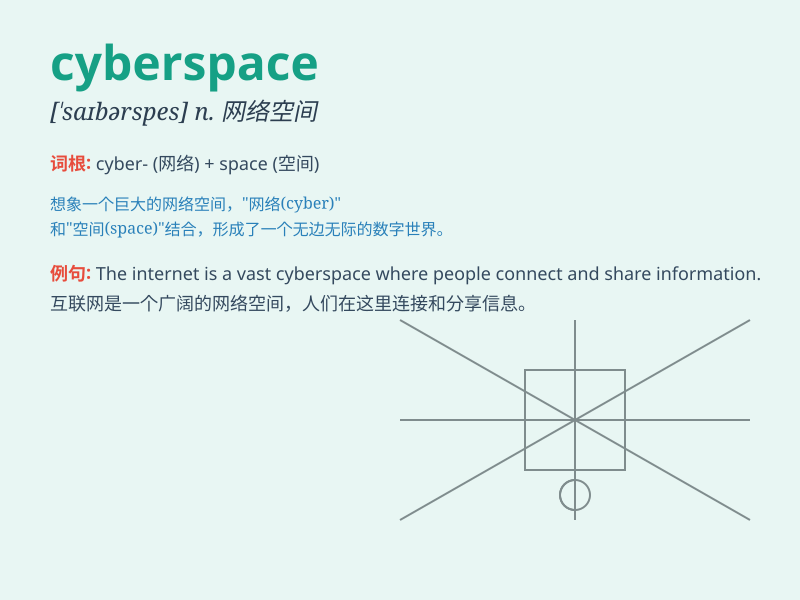

## cyberspace

**英音:** _[\'saɪbəspeɪs]_ **美音:** _[\'saɪbɚspes]_

**译义:** *n.电脑空间*

### 短语

+ **enter cyberspace:** _进入网络空间_

+ **navigate cyberspace:** _在网络空间中导航_

+ **cyberspace security:** _网络空间安全_

+ **explore cyberspace:** _探索网络空间_

+ **cyberspace warfare:** _网络空间战_

### 例句

#### 例句1

> **The company operates in the vast cyberspace to reach a global
audience.**

**中文翻译:** 该公司在广阔的网络空间中运营，以覆盖全球受众。

**单词释义:** 网络空间

#### 例句2

> **Cyberspace has brought both convenience and challenges to our
lives.**

**中文翻译:** 网络空间给我们的生活带来了便利，也带来了挑战。

**单词释义:** 网络空间

#### 例句3

> **He spends a lot of time exploring the unknown regions of
cyberspace.**

**中文翻译:** 他花了很多时间探索网络空间的未知领域。

**单词释义:** 网络空间

### 背诵小故事

> In a future world, a brave adventurer named Tom explores the
mysterious and vast cyberspace. He discovers hidden treasures and faces
challenges. Cyberspace becomes his playground of adventure and growth.

**在未来世界，一位名叫汤姆的勇敢冒险家探索神秘而广阔的网络空间。他发现隐藏的宝藏并面临挑战。网络空间成为了他冒险和成长的乐园。**

### 图义

