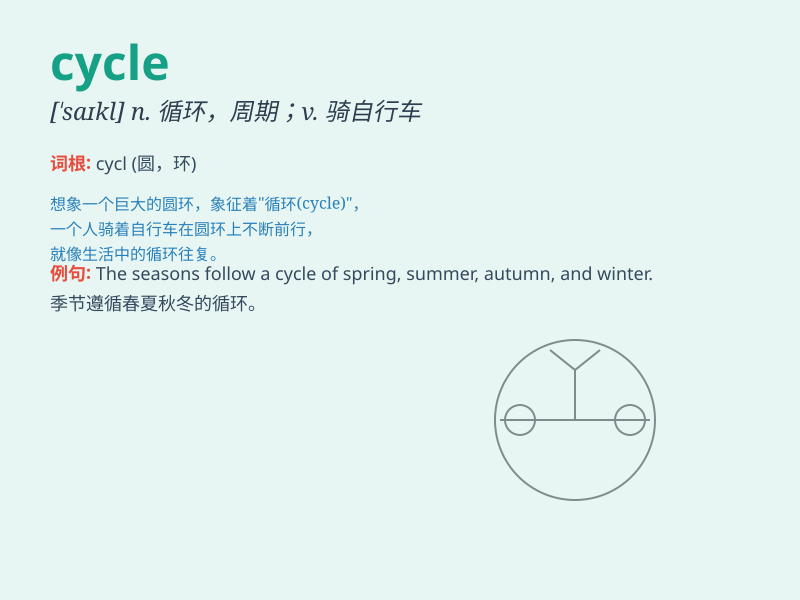

## cycle

**英音:** _[\'saɪk(ə)l]_ **美音:** _[\'saɪkl]_

**译义:**
*n.周期,循环,自行车,一段时间,整套,(电学)周波vi.循环,轮转,骑自行车vt.使循环,使轮转*

### 短语

+ **life cycle:** _生命周期；生活周期_

+ **bicycle:** _自行车；脚踏车_

+ **cycle path:** _自行车道_

+ **economic cycle:** _经济周期_

+ **vicious cycle:** _恶性循环_

### 例句

#### 例句1

> **I cycle to work every day.**

**中文翻译:** 我每天骑车去上班。

**单词释义:** 骑自行车

#### 例句2

> **The business cycle has its ups and downs.**

**中文翻译:** 商业周期有起有落。

**单词释义:** 周期

#### 例句3

> **She cycles through a range of emotions very quickly.**

**中文翻译:** 她很快就会经历各种情绪。

**单词释义:** 循环

### 背诵小故事

> A brave boy rides his bike in a circle every day. The circular path
he takes is like a cycle. One day, he realizes that life also has its
own cycles of ups and downs.

**一个勇敢的男孩每天都骑着自行车绕圈。他所走的圆形路径就像一个周期。有一天，他意识到生活也有自己的起起落落的周期。**

### 图义

