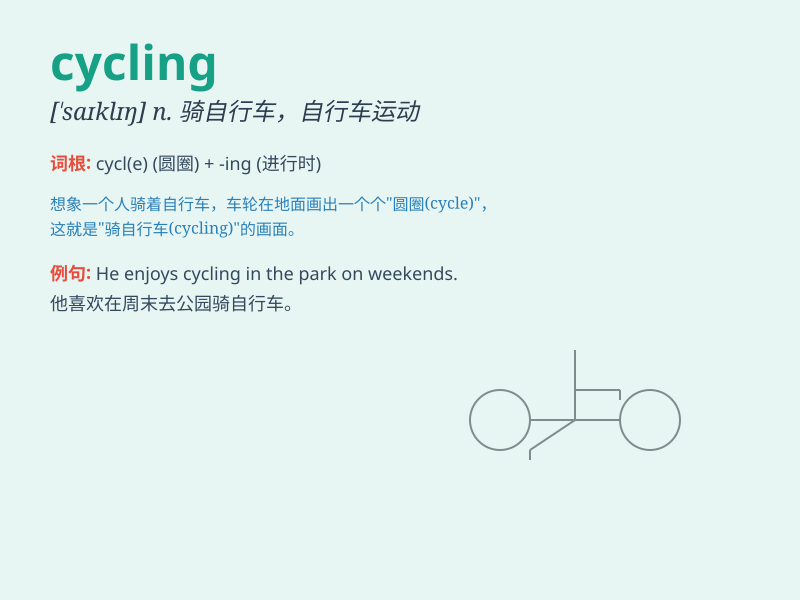

## cycling

**英音:** _[\'saɪklɪŋ]_ **美音:** _[\'saɪklɪŋ]_

**译义:** *n.骑脚踏车兜风,骑脚踏车消遣*

### 短语

+ **mountain cycling:** _山地骑行_

+ **road cycling:** _公路自行车赛_

+ **cycling race:** _自行车比赛_

+ **cycling enthusiast:** _自行车运动爱好者_

+ **cycling tour:** _自行车旅行_

### 例句

#### 例句1

> **I enjoy cycling in the park on weekends.**

**中文翻译:** 我喜欢周末在公园骑自行车。

**单词释义:** 骑自行车

#### 例句2

> **Cycling is a great form of exercise.**

**中文翻译:** 骑自行车是一种很好的锻炼方式。

**单词释义:** 骑自行车

#### 例句3

> **He goes cycling every morning to stay fit.**

**中文翻译:** 他每天早上都骑自行车以保持健康。

**单词释义:** 骑自行车

### 背诵小故事

> One day, Tom was very sad because he was stuck at home. Then he
decided to go cycling. The wind blew gently as he pedaled. Cycling made
him happy and forget all his troubles.

**一天，汤姆非常伤心，因为他被困在家里。然后他决定去骑自行车。当他蹬车时，微风轻轻吹拂。骑自行车让他开心起来，忘记了所有烦恼。**

### 图义

