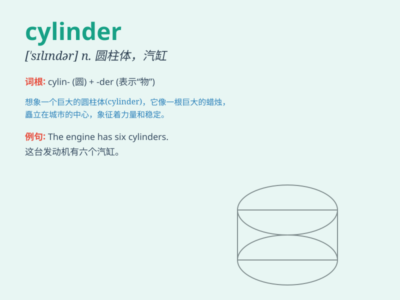

## cylinder

**英音:** _[\'sɪlɪndə]_ **美音:** _[\'sɪlɪndɚ]_

**译义:** *n.圆筒,圆柱体,汽缸,柱面*

### 短语

+ **cylinder head:** _汽缸盖_

+ **gas cylinder:** _煤气罐；气体钢瓶_

+ **hydraulic cylinder:** _液压缸；油压缸_

+ **cylinder block:** _气缸体；气缸组_

+ **steam cylinder:** _蒸汽缸_

### 例句

#### 例句1

> **The engine has six cylinders.**

**中文翻译:** 这台发动机有六个汽缸。

**单词释义:** 汽缸

#### 例句2

> **A gas cylinder is dangerous if not handled properly.**

**中文翻译:** 如果使用不当，煤气罐是很危险的。

**单词释义:** 煤气罐；钢瓶

#### 例句3

> **The hydraulic cylinder lifted the heavy load effortlessly.**

**中文翻译:** 液压缸毫不费力地举起了重物。

**单词释义:** 液压缸

### 背诵小故事

> A thief wanted to steal something from a factory. He found a strange
object - a cylinder. It was long and round like a big pipe. When he
tried to move it, he made a lot of noise and was caught.

**一个小偷想从一家工厂偷东西。他发现了一个奇怪的物体------一个圆柱体。它又长又圆，像一根大管子。当他试图移动它时，弄出了很大的声响，然后被抓住了。**

### 图义

