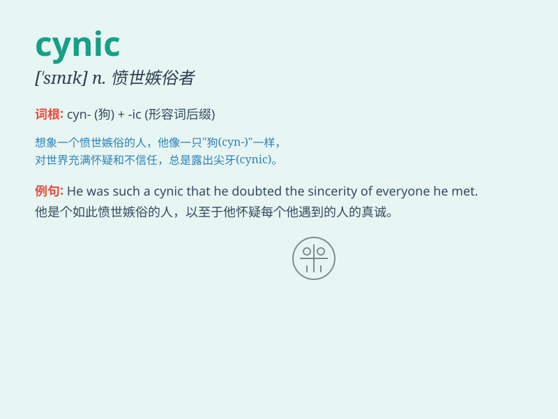

## cynic

**英音:** _[\'sɪnɪk]_ **美音:** _[\'sɪnɪk]_

**译义:** *n.愤世嫉俗者*

### 短语

+ **cynic philosopher:** _犬儒派哲学家_

+ **professional cynic:** _职业的愤世嫉俗者_

+ **moral cynic:** _道德上的愤世者_

+ **political cynic:** _政治上的冷嘲热讽者_

+ **cynic attitude:** _愤世嫉俗的态度_

### 例句

#### 例句1

> **He\'s such a cynic that he never believes in anyone\'s good
intentions.**

**中文翻译:** 他是个愤世嫉俗的人，从不相信任何人的善意。

**单词释义:** 愤世嫉俗的人

#### 例句2

> **The cynic in her always doubts the sincerity of others\'
praise.**

**中文翻译:** 她内心的愤世嫉俗总是怀疑别人赞美的诚意。

**单词释义:** 愤世嫉俗者

#### 例句3

> **I don\'t want to become a cynic and lose faith in humanity.**

**中文翻译:** 我不想成为一个愤世嫉俗者并对人性失去信心。

**单词释义:** 愤世嫉俗的

### 背诵小故事

> A man always doubts others\' motives and scoffs at kindness. He is a
cynic. One day, when someone helped him sincerely, he still refused to
believe. But in the end, he realized his mistake.

**一个男人总是怀疑别人的动机，嘲笑善良。他是个愤世嫉俗者。有一天，当有人真诚地帮助他时，他仍然拒绝相信。但最后，他意识到了自己的错误。**

### 图义

