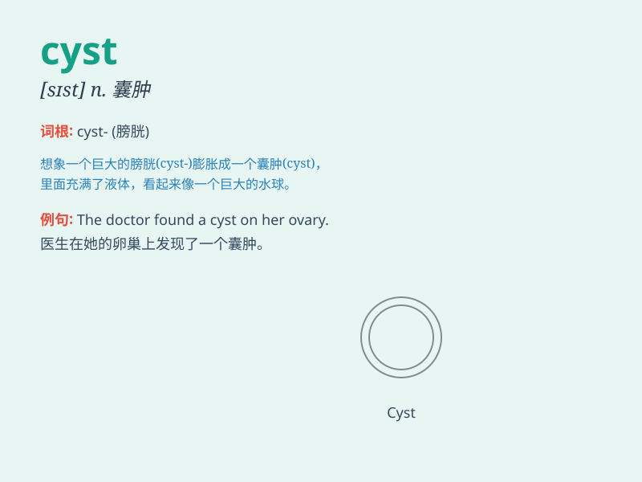

## cyst

**英音:** _[sɪst]_ **美音:** _[sɪst]_

**译义:** *n.[生物](动、植物的)胞,包囊,膀胱,囊肿*

### 短语

+ **ovarian cyst:** _卵巢囊肿_

+ **sebaceous cyst:** _皮脂腺囊肿_

+ **dermoid cyst:** _皮样囊肿_

+ **cyst rupture:** _囊肿破裂_

+ **cyst excision:** _囊肿切除术_

### 例句

#### 例句1

> **The doctor discovered a cyst on her ovary during the
examination.**

**中文翻译:** 医生在检查时发现她的卵巢有一个囊肿。

**单词释义:** 囊肿

#### 例句2

> **The cyst was benign and required no immediate treatment.**

**中文翻译:** 囊肿是良性的，不需要立即治疗。

**单词释义:** 囊肿

#### 例句3

> **He had surgery to remove the cyst from his kidney.**

**中文翻译:** 他接受了手术切除肾脏囊肿。

**单词释义:** 囊肿

### 背诵小故事

> Imagine a little monster with a big bag on its body. That bag is like
a cyst. It\'s a closed sac filled with liquid or semi-solid stuff. Just
like the monster\'s strange bag, a cyst can show up in our body
sometimes.

**想象一只小怪兽身上有个大袋子。那个袋子就像一个囊肿。它是一个充满液体或半固体物质的封闭囊。就像小怪兽身上奇怪的袋子一样，囊肿有时会出现在我们身体里。**

### 图义

