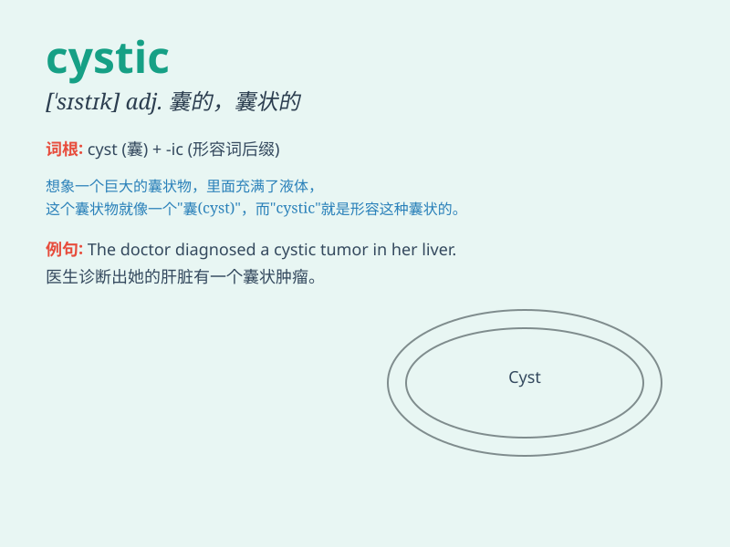

## cystic

**英音:** _[\'sɪstɪk]_ **美音:** _[\'sɪstɪk]_

**译义:** *adj.胞囊的,[医]膀胱的,胆囊的*

### 短语

+ **cystic fibrosis:** _囊性纤维化（一种遗传性疾病）_

+ **cystic duct:** _胆囊管_

+ **cystic hygroma:** _囊状水瘤_

+ **cystic tumor:** _囊性肿瘤_

+ **cystic acne:** _囊性痤疮_

### 例句

#### 例句1

> **The doctor diagnosed the patient with a cystic tumor.**

**中文翻译:** 医生诊断出患者患有囊性肿瘤。

**单词释义:** 囊性的

#### 例句2

> **The cystic fibrosis is a serious genetic disorder.**

**中文翻译:** 囊性纤维化是一种严重的遗传性疾病。

**单词释义:** 囊性的

#### 例句3

> **She has a cystic acne problem on her face.**

**中文翻译:** 她的脸上有囊肿性痤疮问题。

**单词释义:** 囊性的

### 背诵小故事

> A cystic monster had a big cyst on its body. It was very painful. But
with the help of a magic doctor, the cyst was removed and the monster
became healthy. Remember, \'cystic\' is related to cysts.

**一只囊性的怪物身上有个大囊肿，非常痛苦。但在一位神奇医生的帮助下，囊肿被移除，怪物恢复了健康。记住，\'cystic\'
与囊肿有关。**

### 图义

