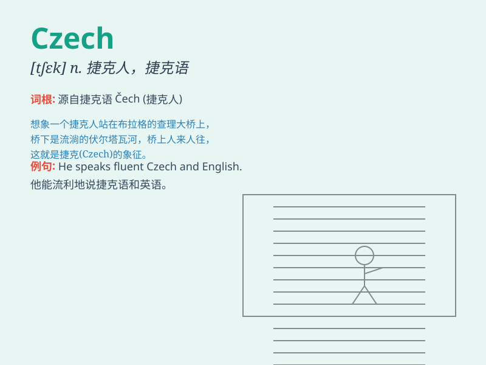

## Czech

**英音:** _[tʃɛk]_ **美音:** _[tʃɛk]_

**译义:** *n.捷克人；捷克语；adj.捷克的；捷克人的；捷克语的*

### 短语

+ **Czech Republic:** _捷克共和国_

+ **Czech language:** _捷克语_

+ **Czech cuisine:** _捷克美食_

+ **Czech people:** _捷克人_

+ **Czech history:** _捷克历史_

### 例句

#### 例句1

> **She is learning Czech because she wants to visit Prague.**

**中文翻译:** 她正在学习捷克语，因为她想去布拉格游玩。

**单词释义:** 捷克语

#### 例句2

> **The Czech Republic is known for its beautiful castles.**

**中文翻译:** 捷克共和国以其美丽的城堡而闻名。

**单词释义:** 捷克的；捷克人的

#### 例句3

> **He has many Czech friends who are very friendly.**

**中文翻译:** 他有很多非常友好的捷克朋友。

**单词释义:** 捷克的；捷克人的

### 背诵小故事

>
想象一下，你在捷克（Czech）旅行，遇到一位友好的当地人，他递给你一杯特色的捷克啤酒。你品尝着美味的啤酒，记住了这个代表着充满魅力的国度的单词------Czech。

**想象你在捷克旅行时的情景，通过这个来记住'Czech（捷克）'这个单词。**

### 图义

