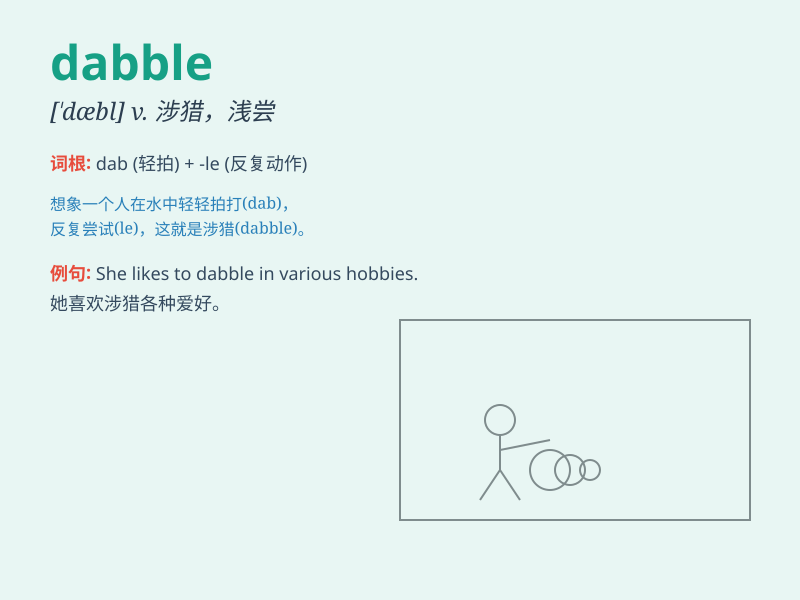

## dabble

**英音:** _[\'dæb(ə)l]_ **美音:** _[\'dæbl]_

**译义:** *v.弄湿,弄水,涉足*

### 短语

+ **dabble in:** _涉足；浅尝；涉猎_

+ **dabble with:** _摆弄；随便对待_

+ **dabble at:** _在\...方面浅尝辄止_

+ **dabble out:** _断断续续地做_

+ **dabble into:** _偶然进入；涉足_

### 例句

#### 例句1

> **He likes to dabble in painting during his spare time.**

**中文翻译:** 他喜欢在业余时间涉猎绘画。

**单词释义:** 涉猎；涉足

#### 例句2

> **Don\'t dabble in matters you don\'t understand.**

**中文翻译:** 不要涉足你不了解的事情。

**单词释义:** 涉足；浅尝

#### 例句3

> **She has dabbled in various sports but never stuck with one.**

**中文翻译:** 她曾涉足各种体育项目，但从未坚持一项。

**单词释义:** 浅尝；尝试

### 背诵小故事

>
想象一下，一只小鸭子在池塘边好奇地玩水，它只是轻轻地用脚掌触碰水面，浅尝辄止。这种轻轻触碰、浅尝的行为就像\'dabble\'。小鸭子并没有深入水中，只是偶尔玩耍一下。

**想象一只小鸭子在池塘边浅尝玩水的情景来辅助记忆\'dabble\'这个单词，意思是涉猎，浅尝**

### 图义

