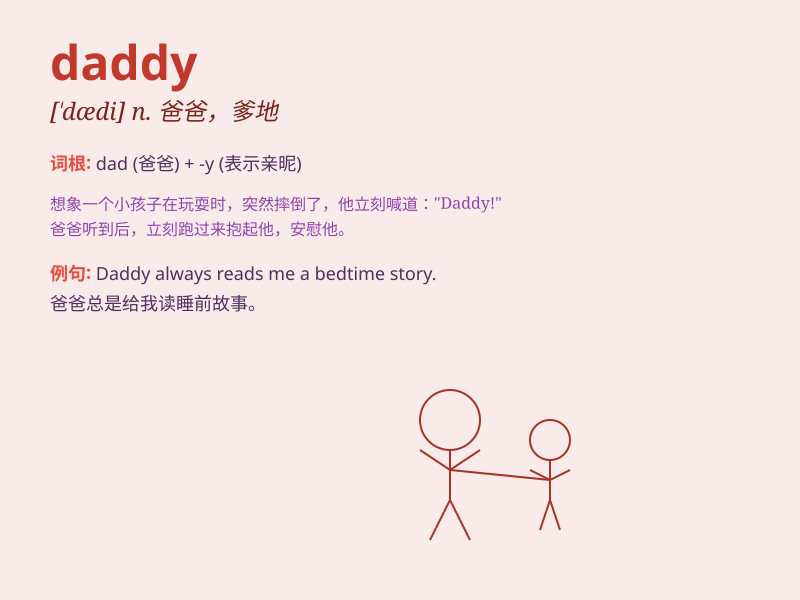

## daddy

**英音:** _[\'dædɪ]_ **美音:** _[\'dædi]_

**译义:** *n.爸爸*

### 短语

+ **dear daddy:** _亲爱的爸爸_

+ **big daddy:** _重要人物；有影响力的人_

+ **stay-at-home daddy:** _全职爸爸_

+ **new daddy:** _新爸爸_

+ **working daddy:** _工作的爸爸_

### 例句

#### 例句1

> **Daddy, can you play with me?**

**中文翻译:** 爸爸，你能和我一起玩吗？

**单词释义:** 父亲（用于儿童对父亲的称呼）

#### 例句2

> **I love you, Daddy.**

**中文翻译:** 我爱你，爸爸。

**单词释义:** 爸爸

#### 例句3

> **Daddy is very busy today.**

**中文翻译:** 爸爸今天非常忙。

**单词释义:** 父亲

### 背诵小故事

> A little girl lost her way. She was crying and calling \'Daddy!
Daddy!\' loudly. A kind policeman heard her and helped her find her
daddy. The girl was so happy when she saw her daddy again.

**一个小女孩迷路了。她大哭着大声喊'爸爸！爸爸！'。一位好心的警察听到了，帮助她找到了爸爸。当女孩再次见到爸爸时，她非常开心。**

### 图义

