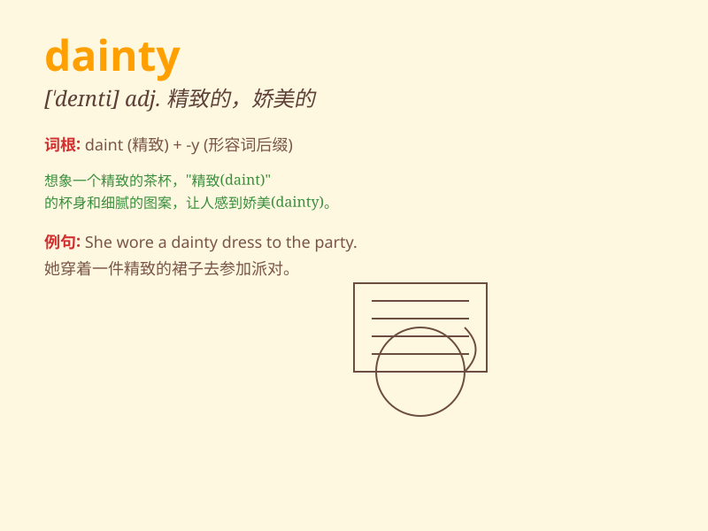

## dainty

**英音:** _[\'deɪntɪ]_ **美音:** _[\'denti]_

**译义:**
*n.适口的食物,美味;adj.秀丽的,优美的,讲究的,挑剔的,适口的*

### 短语

+ **dainty food:** _精致的食物_

+ **dainty steps:** _优雅的脚步_

+ **dainty hands:** _纤细的手_

+ **dainty dress:** _漂亮的连衣裙_

+ **dainty taste:** _高雅的品味_

### 例句

#### 例句1

> **She wore a dainty dress to the party.**

**中文翻译:** 她穿着一件精致的连衣裙去参加聚会。

**单词释义:** 精致的，小巧玲珑的（形容衣服）

#### 例句2

> **The dainty flowers added charm to the garden.**

**中文翻译:** 娇嫩的花朵给花园增添了魅力。

**单词释义:** 娇美的，秀丽的（形容花朵）

#### 例句3

> **He has a dainty appetite and eats very little.**

**中文翻译:** 他胃口很好，吃得很少。

**单词释义:** （胃口）小的，挑剔的

### 背诵小故事

> A fairy in the forest was known for her dainty steps. Every move she
made was light and graceful, like a gentle breeze. Her dainty appearance
and manner charmed all the creatures.

**森林里的一位仙女以她轻盈优美的步伐而闻名。她的每一个动作都轻盈而优雅，就像一阵微风。她精致的外表和举止迷住了所有的生物。**

### 图义

