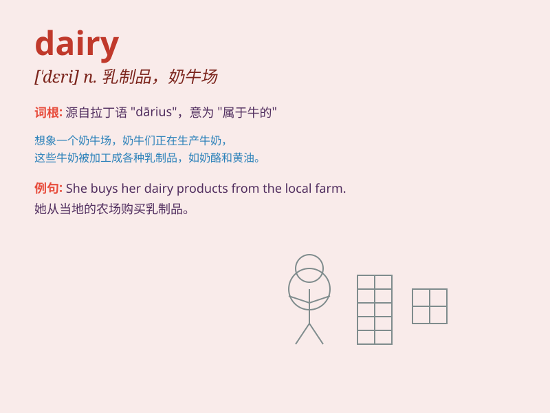

## dairy

**英音:** _[\'deərɪ]_ **美音:** _[\'dɛri]_

**译义:** *n.牛奶场,奶品场,售牛奶,奶油,鸡蛋等的商店,奶制品*

### 短语

+ **dairy farm:** _奶牛场；乳牛场_

+ **dairy product:** _乳制品_

+ **dairy cattle:** _奶牛；乳牛_

+ **dairy industry:** _乳品业；乳制品行业_

+ **dairy maid:** _挤奶女工_

### 例句

#### 例句1

> **I go to the dairy to buy some fresh milk every morning.**

**中文翻译:** 我每天早上都会去牛奶店买一些新鲜牛奶。

**单词释义:** 乳品店

#### 例句2

> **The dairy products in this supermarket are of high quality.**

**中文翻译:** 这家超市的乳制品质量很高。

**单词释义:** 乳制品

#### 例句3

> **She works in a dairy farm and takes care of cows.**

**中文翻译:** 她在一家奶牛场工作并照顾奶牛。

**单词释义:** 奶牛场

### 背诵小故事

> A girl named Lily worked in a dairy. Every day, she milked cows and
made delicious cheese. She loved the smell of fresh milk. One day, she
decided to open her own dairy shop.

**一个叫莉莉的女孩在一家乳制品厂工作。每天，她给奶牛挤奶并制作美味的奶酪。她喜欢新鲜牛奶的味道。有一天，她决定开一家自己的乳制品店。**

### 图义

