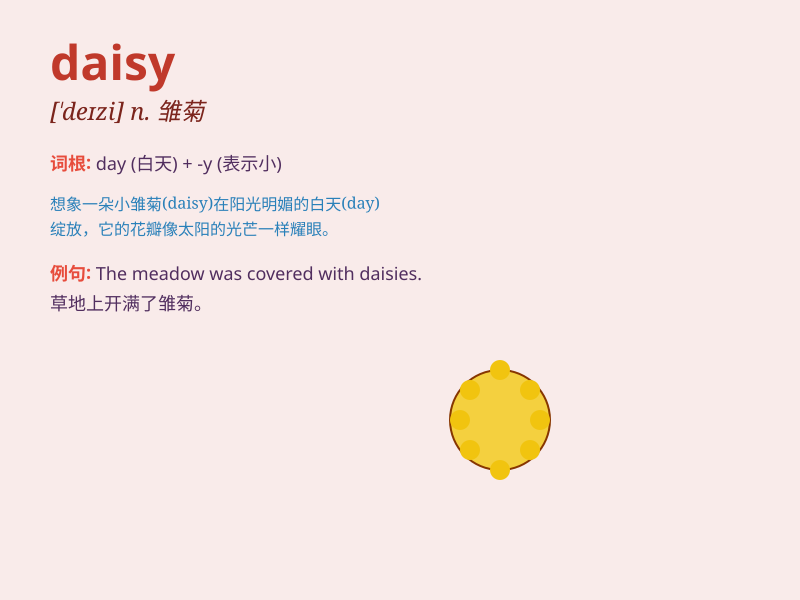

## daisy

**英音:** _[\'deɪzɪ]_ **美音:** _[\'dezɪ]_

**译义:** *n.雏菊,第一流的,一流的人物 Daisy 戴西(女子名)*

### 短语

+ **daisy chain:** _菊花链；（计算机）串接_

+ **daisy wheel:** _菊花轮（打印机的一种打印部件）_

+ **daisy cutter:** _（板球）低飞球；（炸弹）近地爆炸弹_

+ **shasta daisy:** _大滨菊_

+ **oxeye daisy:** _牛眼菊_

### 例句

#### 例句1

> **She picked a daisy and put it in her hair.**

**中文翻译:** 她摘了一朵雏菊，把它插在头发上。

**单词释义:** 雏菊（一种花）

#### 例句2

> **The field was full of daisies.**

**中文翻译:** 田野里开满了雏菊。

**单词释义:** 雏菊（复数形式）

#### 例句3

> **He gave her a bunch of daisies as a gift.**

**中文翻译:** 他送给她一束雏菊作为礼物。

**单词释义:** 雏菊（复数形式）

### 背诵小故事

> A little girl named Daisy loved to run in the fields full of flowers.
Every time she saw a daisy, she smiled. The daisy became her favorite
flower. Remember, Daisy is a kind of flower.

**一个叫黛西的小女孩喜欢在满是鲜花的田野里奔跑。每次她看到雏菊，她都会微笑。雏菊成了她最喜欢的花。记住，daisy
是雏菊的意思。**

### 图义

