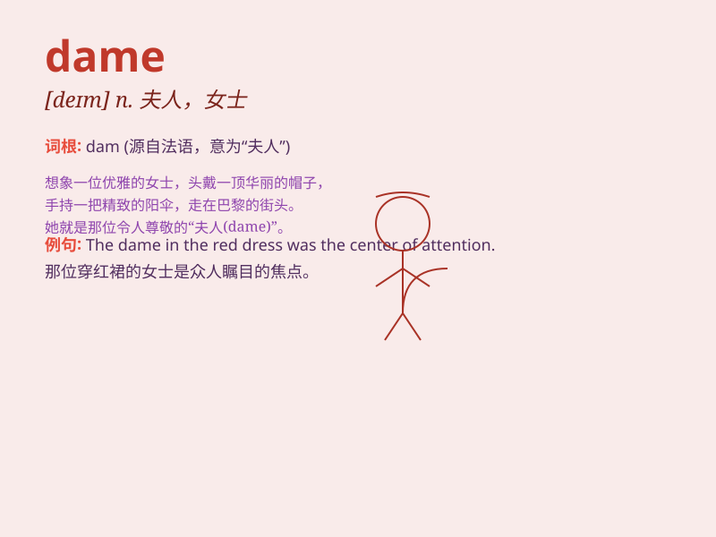

## dame

**英音:** _[deɪm]_ **美音:** _[deɪm]_

**译义:** *n.夫人,(英国)女爵士(的头衔)*

### 短语

+ **Dame Fortune:** _命运女神_

+ **Dame School:** _由老妇人主办的家庭小学_

+ **Dame Nature:** _大自然女神_

+ **Dame of Honor:** _女荣誉爵士_

### 例句

#### 例句1

> **The dame walked gracefully along the street.**

**中文翻译:** 这位女士优雅地沿着街道走着。

**单词释义:** 女士

#### 例句2

> **She is a dame of high reputation.**

**中文翻译:** 她是一位声誉很高的女士。

**单词释义:** 女士

#### 例句3

> **The old dame told us many interesting stories.**

**中文翻译:** 这位老妇人给我们讲了许多有趣的故事。

**单词释义:** 妇人

### 背诵小故事

> Once upon a time, a young knight was seeking a noble dame. He crossed
rivers and climbed mountains, finally finding the dame in a beautiful
castle. The dame\'s grace and charm left a deep impression on him.

**从前，一位年轻的骑士在寻找一位高贵的女士。他穿过河流，爬过山岭，最终在一座美丽的城堡里找到了这位女士。这位女士的优雅和魅力给他留下了深刻的印象。**

### 图义

