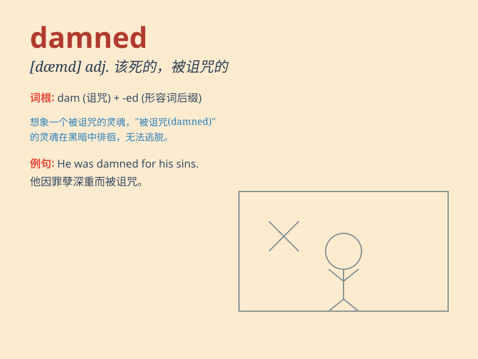

## damned

**英音:** _[dæmd]_ **美音:** _[dæmd]_

**译义:** *adj.该死的,被咒骂的 使人憎厌的,糟透的adv.非常,十分,极*

### 短语

+ **damned soul:** _被诅咒的灵魂_

+ **be damned:** _该死；遭殃_

+ **damned hard:** _极其困难_

+ **damned fool:** _大笨蛋_

+ **damned lie:** _弥天大谎_

### 例句

#### 例句1

> **This damned weather ruined our picnic.**

**中文翻译:** 这该死的天气毁了我们的野餐。

**单词释义:** 可恶的；讨厌的

#### 例句2

> **I\'m damned if I\'ll do it!**

**中文翻译:** 我决不会干那种事！

**单词释义:** （加强语气）绝对

#### 例句3

> **He\'s a damned good player.**

**中文翻译:** 他是个非常出色的球员。

**单词释义:** 非常；极其

### 背诵小故事

> A brave explorer was lost in a mysterious forest. Every step he took
seemed damned. But he didn\'t give up and finally found his way out.
Here, \'damned\' means doomed or hopeless.

**一位勇敢的探险家在一片神秘森林中迷路了。他走的每一步似乎都注定失败。但他没有放弃，最终找到了出路。这里，\'damned\'意思是注定的或没有希望的。**

### 图义

