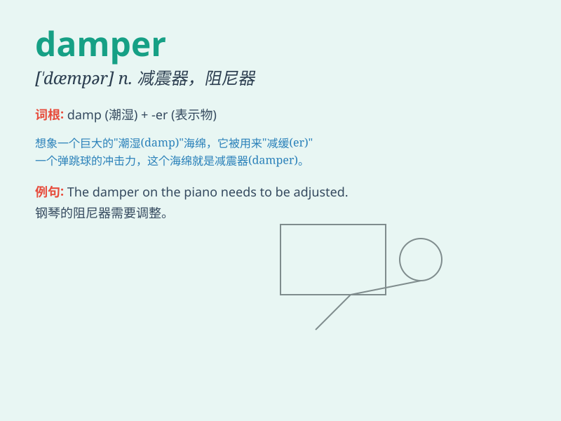

## damper

**英音:** _[\'dæmpə]_ **美音:** _[\'dæmpɚ]_

**译义:** *n.起抑制作用的因素,节气闸,断音装置*

### 短语

+ **put a damper on:** _使扫兴；抑制；泼冷水_

+ **fire damper:** _防火阀；防火挡板_

+ **vibration damper:** _减震器；减振器_

+ **damper pedal:** _（钢琴的）制音踏板_

+ **damper spring:** _减震弹簧_

### 例句

#### 例句1

> **The bad weather put a damper on our picnic plans.**

**中文翻译:** 糟糕的天气给我们的野餐计划泼了冷水。

**单词释义:** 抑制因素；扫兴的事

#### 例句2

> **A fire damper is installed in the ventilation duct to prevent the
spread of fire.**

**中文翻译:** 通风管道中安装了防火阀以防止火势蔓延。

**单词释义:** 防火阀；节气阀

#### 例句3

> **The new regulations have acted as a damper on the company\'s
expansion.**

**中文翻译:** 新规定对公司的扩张起到了抑制作用。

**单词释义:** 抑制；阻碍

### 背诵小故事

> A hungry mouse was looking for food in a big house. It found a big
damper and thought it was cheese. But when it took a bite, it was so
hard! Poor mouse.

**一只饥饿的老鼠在一个大房子里找食物。它发现了一个大的阻尼器，还以为是奶酪。但当它咬了一口，发现太硬了！可怜的老鼠。**

### 图义

