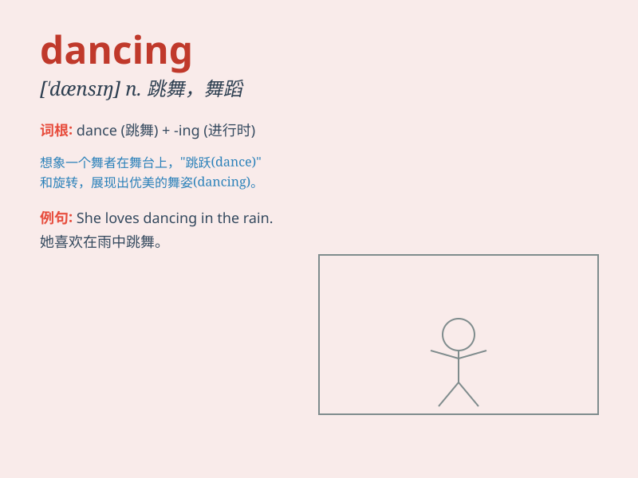

## dancing

**英音:** _[\'dɑːnsɪŋ]_ **美音:** _[\'dænsɪŋ]_

**译义:** *n.舞蹈*

### 短语

+ **dancing party:** _舞会_

+ **dancing shoes:** _舞鞋_

+ **dancing class:** _舞蹈课_

+ **dancing hall:** _舞厅_

+ **dancing partner:** _舞伴_

### 例句

#### 例句1

> **She is good at dancing.**

**中文翻译:** 她擅长跳舞。

**单词释义:** 跳舞；舞蹈

#### 例句2

> **The children are having fun dancing in the park.**

**中文翻译:** 孩子们在公园里跳舞玩得很开心。

**单词释义:** 跳舞

#### 例句3

> **Dancing can help you keep fit.**

**中文翻译:** 跳舞可以帮助你保持健康。

**单词释义:** 跳舞

### 背诵小故事

> One night, I dreamed of being in a big party. Everyone was dancing
happily. The music was wonderful and the lights were colorful. The scene
of people dancing made me feel so cheerful.

**一天晚上，我梦到在一个盛大的派对上。每个人都开心地跳着舞。音乐美妙，灯光绚丽。人们跳舞的场景让我感到非常愉快。**

### 图义

