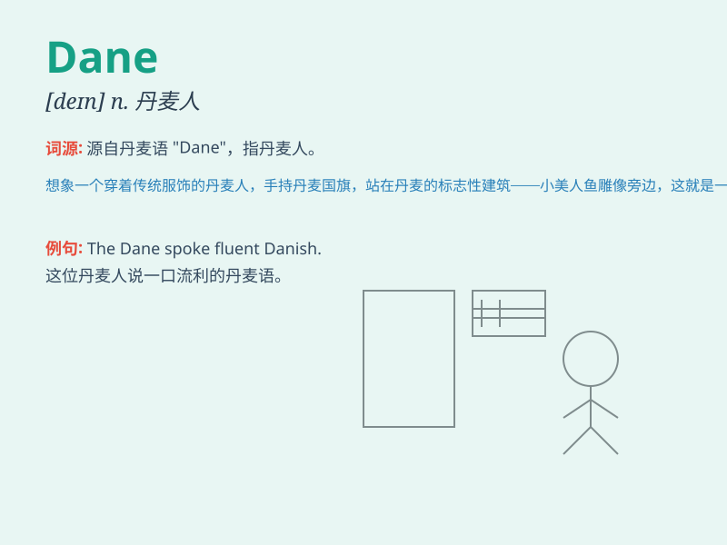

## Dane

**英音:** _[deɪn]_ **美音:** _[den]_

**译义:** *n.丹麦人;丹麦语*

### 短语

+ **Dane County:** _戴恩县（美国地名）_

+ **The Great Dane:** _大丹犬_

+ **Young Dane:** _年轻的丹麦人_

+ **Dane blood:** _丹麦人的血统_

+ **Honest Dane:** _诚实的丹麦人_

### 例句

#### 例句1

> **The Dane is known for his excellent craftsmanship.**

**中文翻译:** 这位丹麦人以其精湛的工艺而闻名。

**单词释义:** 丹麦人

#### 例句2

> **She married a Dane and moved to Copenhagen.**

**中文翻译:** 她嫁给了一个丹麦人并搬到了哥本哈根。

**单词释义:** 丹麦人

#### 例句3

> **The Dane has a great passion for music.**

**中文翻译:** 这个丹麦人对音乐有着极大的热情。

**单词释义:** 丹麦人

### 背诵小故事

> Once upon a time, there was a friendly Dane named Tom. He loved
traveling and sharing his stories. One day, he met a group of people and
introduced himself as a Dane. Everyone was impressed by his charm.

**从前，有一个友好的丹麦人叫汤姆。他喜欢旅行并分享他的故事。有一天，他遇到一群人，并介绍自己是丹麦人。每个人都对他的魅力印象深刻。**

### 图义

