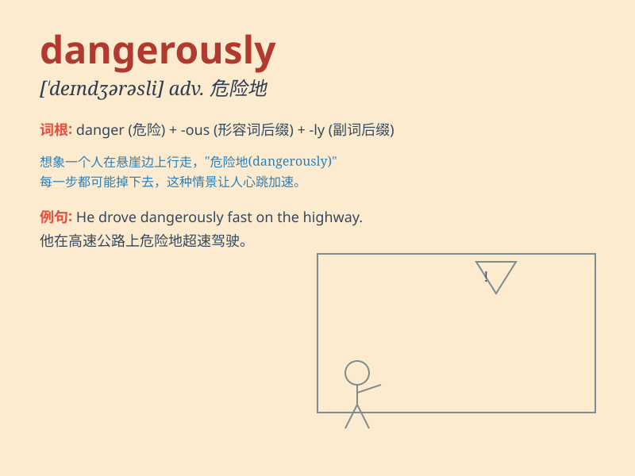

## dangerously

**英音:** _[ˈdeɪndʒərəsli]_ **美音:** _[ˈdeɪndʒərəsli]_

**译义:** *副词，危险地，不安全地；极其严重地*

### 短语

+ **dangerously close:** _危险地接近_

+ **dangerously ill:** _病得很重；病危_

+ **dangerously high:** _危险地高_

+ **dangerously low:** _危险地低_

+ **drive dangerously:** _危险驾驶_

### 例句

#### 例句1

> **The car was speeding dangerously on the highway.**

**中文翻译:** 这辆汽车在高速公路上危险地超速行驶。

**单词释义:** 危险地

#### 例句2

> **He climbed the tree dangerously, without any safety
equipment.**

**中文翻译:** 他危险地爬上了树，没有任何安全设备。

**单词释义:** 危险地

#### 例句3

> **The situation is developing dangerously and we need to act
quickly.**

**中文翻译:** 局势正在危险地发展，我们需要迅速行动。

**单词释义:** 危险地

### 背诵小故事

> One day, a brave adventurer was exploring a mysterious cave. He
walked dangerously close to a deep pit. Just one wrong step and he could
fall. But his caution saved him. Remember, \'dangerously\' means in a
way that is full of danger.

**有一天，一位勇敢的探险家正在探索一个神秘的洞穴。他危险地靠近一个深坑。只要走错一步，他就可能掉下去。但他的谨慎救了他。记住，\'dangerously\'意思是以充满危险的方式。**

### 图义

