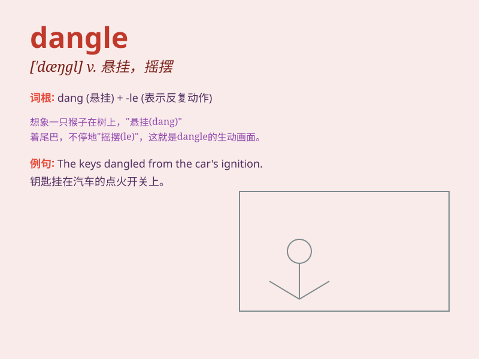

## dangle

**英音:** _[\'dæŋg(ə)l]_ **美音:** _[\'dæŋɡl]_

**译义:** *v.摇摆*

### 短语

+ **dangle before:** _在\...\...面前摇晃；引诱_

+ **dangle from:** _从\...\...悬挂_

+ **dangle out:** _悬垂在外_

+ **dangle about:** _到处晃悠_

+ **dangle after:** _追求；紧跟_

### 例句

#### 例句1

> **She dangled her feet in the pool.**

**中文翻译:** 她在游泳池里晃荡着双脚。

**单词释义:** （使）悬垂，（使）悬荡

#### 例句2

> **The keys dangled from his pocket.**

**中文翻译:** 钥匙从他的口袋里晃荡着。

**单词释义:** （使）悬挂着，（使）吊着

#### 例句3

> **He dangled the toy in front of the baby to make her laugh.**

**中文翻译:** 他在婴儿面前晃动着玩具逗她笑。

**单词释义:** （在......面前）摇晃（某物）

### 背诵小故事

> 想象一下，一只猴子在树枝上，它的尾巴（tail）dangle
着晃来晃去。它轻松自在，尾巴就那样悬垂着，好像在跟大家炫耀它的灵活。

**想象一只猴子的尾巴悬垂晃荡，以此来记住'dangle（悬垂，摇晃）'这个单词。**

### 图义

