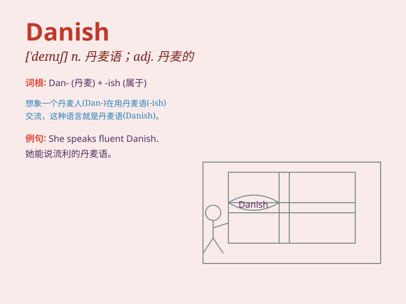

## Danish

**英音:** _[ˈdæn.ɪʃ]_ **美音:** _[ˈdæn.ɪʃ]_

**译义:** *adj. 丹麦的；丹麦人的；n. 丹麦人；丹麦语；丹麦糕点*

### 短语

+ **Danish pastry:** _丹麦酥皮饼_

+ **Danish blue:** _丹麦青纹干酪_

+ **Danish bacon:** _丹麦式熏猪肉_

+ **Danish oil:** _丹麦油（一种清漆）_

+ **Danish furniture:** _丹麦家具_

### 例句

#### 例句1

> **I love Danish pastries.**

**中文翻译:** 我喜欢丹麦糕点。

**单词释义:** 丹麦的；丹麦人的；丹麦语的

#### 例句2

> **She is learning Danish at university.**

**中文翻译:** 她在大学里学习丹麦语。

**单词释义:** 丹麦语

#### 例句3

> **The Danish team won the championship.**

**中文翻译:** 丹麦队赢得了冠军。

**单词释义:** 丹麦的

### 背诵小故事

> Once upon a time, there was a traveler who met a friendly chef. The
chef offered him some delicious pastries and said, \'This is Danish
cuisine.\' The traveler loved it and remembered the word \'Danish\' for
the special food.

**从前，有一位旅行者遇到了一位友好的厨师。厨师给他提供了一些美味的糕点，并说：'这是丹麦美食。'旅行者很喜欢，并记住了'Danish'这个代表丹麦的词。**

### 图义

